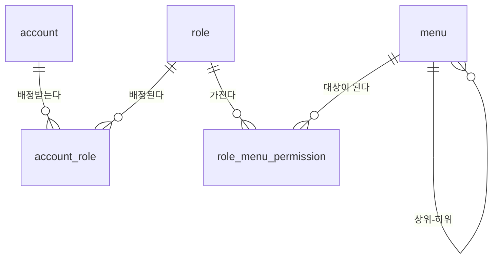

# 1. 사용자 · 권한

첫 번째 도메인입니다. 모든 업무 테이블의 감사 컬럼(`created_by` · `updated_by`)이 여기를
참조하므로 이게 없으면 아무것도 못 만듭니다.

범위와 순서는 [scope.md](scope.md), 표기·값 규칙은 [convention.md](../convention.md),
용어는 [glossary.md](glossary.md)에 있습니다.

여기서 정한 것은 **스택과 무관한 것만**입니다. 세션 방식 · 토큰 · 해시 알고리즘 ·
비밀번호 정책 같은 인증 구현은 [TODO.md](../../TODO.md) 3단계입니다.

---

## 1. 결정

| # | 정한 것 | 값 |
|---|---|---|
| 1 | 권한 모델 | **역할 기반.** 관리자가 사용자에게 역할을 부여 |
| 2 | 권한 단위 | **행위를 행으로.** 권한 한 줄 = (역할, 메뉴, 행위) |
| 3 | 역할 배정 | **여러 개 허용.** 사용자 ↔ 역할은 N:M, 유효 권한은 합집합 |
| 4 | 메뉴 정의 | **DB가 마스터.** 관리자가 화면에서 메뉴를 추가·순서변경 |
| 5 | 로그인 식별자 | **아이디.** 관리자가 발급. 이메일은 선택 정보 |

---

## 2. 개념 모델

```
사용자 ──< 사용자역할 >── 역할 ──< 역할메뉴권한 >── 메뉴 ──┐
                                        │                   │
                                        └ 행위               └ 상위메뉴(자기참조)
```



### 2.1 사용자 `account`

```
id             BIGINT        PK. 자동증가
login_id       VARCHAR       로그인 아이디. 고유. 발급 후 변경하지 않는다
name           VARCHAR       이름
email          VARCHAR       NULL 허용. 알림용 선택 정보
password_hash  VARCHAR       원문 저장 금지
active         BOOLEAN       재직 여부. 퇴사하면 false
last_login_at  TIMESTAMPTZ   NULL 허용
+ 감사 컬럼 5종
```

`login_id`를 바꾸지 않는 이유는 사람 대신 화면에 남는 이름이기 때문입니다. 로그와 감사
컬럼 표시는 `name`을 쓰되 동명이인이 있으면 `name (login_id)`로 씁니다.

**퇴사는 `active = false`이지 삭제가 아닙니다.** 모든 테이블의 `created_by` ·
`updated_by`가 `account.id`를 참조하므로 사용자 행을 지우면 과거 전표의 담당자가
사라집니다. `deleted_at`은 "잘못 만든 계정을 없던 일로 할 때"만 씁니다.

사내 계정 정보(이름 · 아이디 · 이메일)는 논리 삭제를 유지합니다. 보관 기간이 걸리는
**고객 개인정보 정책은 6번 주문 도메인**에서 정합니다 — 성격이 다른 데이터입니다.

> 3단계에서 이 테이블에 `theme_palette` · `theme_mode` 두 컬럼이 붙습니다.
> 근거는 [design/theme.md](../design/theme.md) 6.2.

### 2.2 역할 `role`

```
id           BIGINT     PK
role_code    VARCHAR    불변 키. 고유
name         VARCHAR    표시명 (한글)
description  VARCHAR    NULL 허용
is_system    BOOLEAN    시스템 고정 역할. 수정·삭제 불가
active       BOOLEAN
+ 감사 컬럼 5종
```

**`role_code = 'ADMIN'` 은 코드에 고정된 시스템 역할입니다.** 모든 메뉴의 모든 행위를
갖고, 화면에서 삭제·수정할 수 없습니다. 그리고 **이 역할을 가진 활성 사용자가 0명이
되는 변경은 거부합니다.** 관리자를 전부 지워 아무도 못 들어가는 상태가 실제로 자주
납니다.

### 2.3 사용자역할 `account_role`

```
id          BIGINT   PK
account_id  BIGINT   FK → account
role_id     BIGINT   FK → role
UNIQUE (account_id, role_id)
+ created_at · created_by
```

배정·해제 시각과 담당자가 남도록 감사 컬럼을 둡니다. "누가 언제 이 사람한테 권한을
줬나"가 감사에서 가장 먼저 나오는 질문입니다.

### 2.4 메뉴 `menu`

```
id          BIGINT    PK
menu_code   VARCHAR   불변 키. 고유. 권한이 이걸 가리킨다
parent_id   BIGINT    FK → menu. NULL 이면 최상위
name        VARCHAR   표시명 (한글). 바꿔도 된다
path        VARCHAR   화면 경로. NULL 이면 폴더 메뉴
icon_name   VARCHAR   NULL 허용
sort_order  INT       형제 사이의 순서
visible     BOOLEAN   false 면 권한과 무관하게 숨긴다
+ 감사 컬럼 5종
```

DB가 마스터이므로 관리자가 메뉴를 추가하고 순서를 바꿉니다. 대신 규칙이 둘 붙습니다.

**(a) `menu_code`는 불변입니다.** 재사용 금지 · 재배치 금지. 권한 행이 이 값을 가리키고
있어서, 코드를 재사용하면 지운 메뉴의 권한이 새 메뉴에 그대로 붙습니다. 레이아웃 번호와
같은 취급입니다 ([convention.md](../convention.md) 4.4).

**(b) 화면은 코드에 있습니다.** `path`가 가리키는 화면이 코드에 없으면 그 메뉴는
사이드바에 **렌더링하지 않고 경고 로그를 남깁니다.** DB에서 메뉴를 먼저 만들고 화면을
나중에 붙일 수 있어야 하고, 반대로 화면을 지웠는데 메뉴가 남아 있어도 앱이 죽으면 안
됩니다. 깨진 링크는 관리자 화면에서 "화면 없음"으로 표시합니다.

폴더 메뉴(`path IS NULL`)는 자기 권한을 갖지 않습니다. 하위에 보이는 게 하나라도 있으면
보이고, 하나도 없으면 숨습니다.

### 2.5 역할메뉴권한 `role_menu_permission`

```
id       BIGINT   PK
role_id  BIGINT   FK → role
menu_id  BIGINT   FK → menu
action   ENUM     READ | CREATE | UPDATE | DELETE
UNIQUE (role_id, menu_id, action)
+ 감사 컬럼 5종
```

**행이 있으면 허용, 없으면 거부입니다. 거부 행(deny)은 두지 않습니다.** 역할을 여러 개
붙일 수 있어서 합집합으로 계산하는데, 여기에 deny가 섞이면 우선순위 규칙이 필요해지고
그때부터 "왜 이 사람한테 이 메뉴가 안 보이지"를 아무도 못 풉니다.

행위를 값으로 둔 덕에 **가져오기 · 내보내기 · 승인** 같은 게 나중에 생겨도 `action`에
값 하나만 늘리면 됩니다. 테이블 모양은 그대로입니다.

`action` 저장은 영문 SCREAMING_SNAKE, 표시는 한글 매핑입니다
(조회 · 등록 · 수정 · 삭제) — [convention.md](../convention.md) 3.3.

---

## 3. 판정 규칙

**유효 권한 = 사용자가 가진 모든 역할의 권한 합집합.**

```
사용자 → 역할들 → 권한 행들 → (menu_code, action) 집합
```

- **사이드바**: `READ`가 있는 메뉴만 나옵니다. 폴더는 하위가 하나라도 보이면 나옵니다
- **화면 안의 버튼**: 등록/수정/삭제 버튼은 해당 `action`이 있을 때만 그립니다
- **서버**: 매 요청마다 다시 검사합니다

마지막 줄이 핵심입니다. **화면에서 버튼을 숨기는 것은 UX이지 보안이 아닙니다.** 버튼이
없어도 요청은 만들 수 있습니다. 권한 검사는 서버가 진실이고, 프런트는 그 결과를 미리
보여주는 것뿐입니다.

`ADMIN` 역할은 이 계산을 건너뛰고 전부 허용합니다.

---

## 4. 화면

레이아웃 번호는 [갤러리](../../frontend/src/layouts/registry.ts)의 `no`입니다.

| 화면 | 레이아웃 | 구성 |
|---|---|---|
| 사용자 관리 | **18** 목록 + 모달 등록 | 목록에서 바로 등록·수정. 필드가 적어 별도 페이지가 과함 |
| 사용자 상세 — 역할 배정 | **30** 좌우 배정 | 왼쪽 미배정 역할 / 오른쪽 배정된 역할 |
| 역할 관리 | **7** 마스터-디테일 | 왼쪽 역할 목록 / 오른쪽 그 역할의 권한 매트릭스 |
| 메뉴 관리 | **28** 트리 + 그리드 | 왼쪽 메뉴 트리(드래그로 순서·계층) / 오른쪽 속성 편집 |

**역할 관리(7번)의 오른쪽**이 이 도메인의 심장입니다. 메뉴 트리를 세로로, 행위 4개를
가로로 놓은 체크박스 격자입니다. 한 칸이 `role_menu_permission` 한 줄입니다. 행 머리의
체크박스로 그 메뉴 전체, 열 머리로 그 행위 전체를 토글합니다.

`ADMIN` 역할을 선택하면 격자는 전부 체크된 채 읽기 전용입니다.

---

## 5. 다음

2번 **상품** 도메인. 같은 순서로 갑니다.

```
용어사전 추가 → 개념 모델 → 화면 (레이아웃 번호) → 구현
```

구현은 백엔드 스택이 정해진 뒤입니다 ([TODO.md](../../TODO.md) 3 · 5단계). 이 문서는
그때 그대로 스키마가 됩니다.
