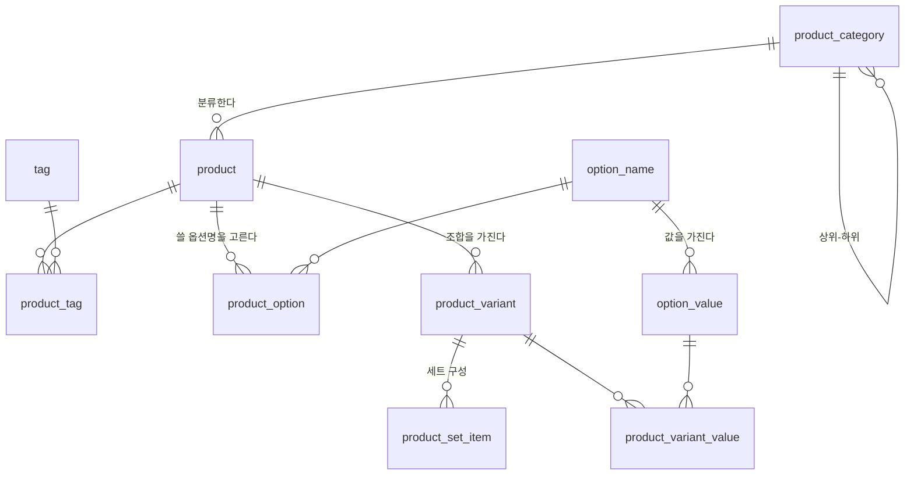

# 2. 상품

두 번째 도메인입니다. 입고 전표 · 주문 라인 · 재고가 전부 여기서 정한 **단위**를
참조하므로, 이걸 잘못 잡으면 뒤에서 못 고칩니다.

용어는 [glossary.md](glossary.md), 표기·값 규칙은 [convention/core.md](../convention/core.md),
순서는 [scope.md](scope.md)에 있습니다.

---

## 1. 결정

| # | 정한 것 | 값 |
|---|---|---|
| 1 | 옵션 구조 | **3층.** 상품 → 옵션명·값 → 옵션조합(SKU) |
| 2 | 세트 상품 | **지금 넣는다.** 세트는 자기 재고를 갖지 않고 구성품에서 깎는다 |
| 3 | SKU 채번 | **비우면 자동, 적으면 그대로.** 등록 후 변경 불가 |
| 4 | 분류 | **계층 카테고리 + 태그 둘 다.** 카테고리는 단일 소속, 태그는 다중 |

### 1.1 물어보지 않고 정한 것

**옵션명·옵션값은 전역 마스터입니다.** 상품마다 "색상"을 따로 만들면 3층으로 간 이유
(오타 방지 · 옵션별 집계)가 그대로 없어집니다. 상품은 **전역 옵션명 중 쓸 것을 고르고**,
조합은 그 옵션명의 값 중 하나씩을 집습니다.

**상품에 기본 공급처를 두지 않습니다.** 공급처는 입고 전표(4번)에서 잡습니다. 한 상품을
여러 곳에서 받는 게 흔하고, 기본값 하나 때문에 3번 거래처를 앞으로 당길 이유가 없습니다.
→ [scope.md](scope.md) 3장의 순서 질문은 이걸로 닫힙니다.

**상품 마스터에 가격을 두지 않습니다.** 판매가는 채널이 정하고(5번), 매입가는 입고
시점마다 다릅니다(4번). 마스터에 한 줄 박아두면 반드시 실제와 틀어지고, 그때 어느 쪽이
맞는지 아무도 모릅니다.

---

## 2. 개념 모델

```
상품분류 ──< 상품 >── 상품태그 >── 태그
              │
              ├──< 상품옵션 >── 옵션명 ──< 옵션값
              │                              │
              └──< 옵션조합(SKU) ──< 조합옵션값 ┘
                        │
                        └──< 세트구성 >── 옵션조합(구성품)
```



### 2.1 상품분류 `product_category`

```
id             BIGINT    PK
category_code  VARCHAR   불변 키. 고유
parent_id      BIGINT    FK → product_category. NULL 이면 최상위
name           VARCHAR   표시명
sort_order     INT
active         BOOLEAN
+ 감사 컬럼 5종
```

메뉴 테이블과 같은 모양입니다. **상품은 말단 분류 하나에만 속합니다.** 중간 노드에 직접
붙이는 걸 막아야 "이 카테고리 매출"이 중복 집계되지 않습니다.

### 2.2 태그 `tag` · 상품태그 `product_tag`

```
tag
  id        BIGINT   PK
  tag_code  VARCHAR  불변 키. 고유
  name      VARCHAR
  active    BOOLEAN
  + 감사 컬럼 5종

product_tag
  id          BIGINT  PK
  product_id  BIGINT  FK → product
  tag_id      BIGINT  FK → tag
  UNIQUE (product_id, tag_id)
  + created_at · created_by
```

**태그는 미리 등록된 것만 붙입니다.** 입력창에서 새 문자열을 자유롭게 만들 수 있게 하면
"기획전", "기획전 ", "기획전2"가 6개월 뒤에 나란히 남습니다.

카테고리는 집계용 단일 소속, 태그는 기획전 · 시즌 · 이슈처럼 겹치는 묶음용입니다.

### 2.3 상품 `product`

```
id            BIGINT    PK
product_code  VARCHAR   업무코드. 고유. 불변. 비우면 자동 채번
name          VARCHAR   상품명
category_id   BIGINT    FK → product_category. 말단만 허용
sell_status   ENUM      SELLING | STOPPED | DISCONTINUED
use_lot       BOOLEAN   로트(사용기한) 관리 여부
memo          TEXT      NULL 허용
+ 감사 컬럼 5종
```

> `use_lot`은 4번 입고 설계에서 추가됐습니다. 켜면 입고할 때 로트를 만들고 재고를
> `(조합, 창고, 로트)`로 셉니다 → [4-receiving.md](4-receiving.md) 3.2.

`sell_status` 표시 매핑 — 판매중 · 판매중지 · 단종
([convention/core.md](../convention/core.md) 3.3).

셋을 나눈 이유는 뒤에서 다르게 처리하기 때문입니다. **판매중지**는 재고가 있는데 잠깐
안 파는 것이라 재고 실사 대상이고, **단종**은 소진 후 정리 대상입니다. 하나로 합치면
"이거 다시 살릴 건가요"를 매번 사람한테 물어야 합니다.

### 2.4 옵션명 `option_name` · 옵션값 `option_value`

```
option_name
  id                BIGINT   PK
  option_name_code  VARCHAR  불변 키. 고유
  name              VARCHAR  색상 · 사이즈 · 용량
  sort_order        INT
  active            BOOLEAN
  + 감사 컬럼 5종

option_value
  id                 BIGINT   PK
  option_name_id     BIGINT   FK → option_name
  option_value_code  VARCHAR  불변 키
  name               VARCHAR  빨강 · L · 500ml
  sort_order         INT
  active             BOOLEAN
  UNIQUE (option_name_id, option_value_code)
  + 감사 컬럼 5종
```

전역 마스터입니다. `sort_order` 덕에 사이즈가 **S · M · L**로 나오지 가나다순
(L · M · S)으로 나오지 않습니다. 이게 3층의 실질적 이득 중 하나입니다.

### 2.5 상품옵션 `product_option`

```
id              BIGINT  PK
product_id      BIGINT  FK → product
option_name_id  BIGINT  FK → option_name
sort_order      INT     이 상품에서의 옵션 순서
UNIQUE (product_id, option_name_id)
+ 감사 컬럼 5종
```

"이 상품은 색상과 사이즈를 쓴다"를 먼저 정하는 줄입니다. 조합을 만들기 전에 필요하고,
조합 표시명의 **순서**도 여기서 나옵니다 (색상 먼저 → "빨강 / L").

### 2.6 옵션조합 `product_variant` — 이 도메인의 단위

```
id            BIGINT         PK
product_id    BIGINT         FK → product
sku_code      VARCHAR        업무코드. 전역 고유. 불변. 비우면 자동 채번
option_label  VARCHAR        "빨강 / L". 옵션값에서 생성한 표시용
barcode       VARCHAR        NULL 허용. 고유
is_set        BOOLEAN        true 면 자기 재고를 갖지 않는다
safety_stock  DECIMAL(18,3)  NULL 허용. 미달하면 「발주 필요」
active        BOOLEAN
+ 감사 컬럼 5종
```

> `safety_stock`은 8번 재고 설계에서 추가됐습니다. `NULL` 이면 관리하지 않습니다
> → [8-stock.md](8-stock.md) 4장.

```
product_variant_value
  id               BIGINT  PK
  variant_id       BIGINT  FK → product_variant
  option_name_id   BIGINT  FK → option_name
  option_value_id  BIGINT  FK → option_value
  UNIQUE (variant_id, option_name_id)
```

`UNIQUE (variant_id, option_name_id)`가 "한 조합에 색상은 하나"를 강제합니다.

**`option_label`은 의도적인 중복입니다.** 정규화하면 조합 하나 보는 데 세 테이블을
조인해야 하는데, 주문 취합 화면은 채널이 준 문자열("색상: 빨강 / 사이즈: L")과 이 값을
사람이 눈으로 대조하는 게 실제 작업입니다. 그 문자열은 한 컬럼에 있어야 합니다.
옵션값 표시명이 바뀌면 해당 조합들의 `option_label`을 다시 만듭니다.

**입고 · 주문 라인 · 재고는 전부 `product_variant.id`를 참조합니다.** `product`가 아닙니다.

### 2.7 세트구성 `product_set_item`

```
id                    BIGINT         PK
set_variant_id        BIGINT         FK → product_variant (is_set = true)
component_variant_id  BIGINT         FK → product_variant (is_set = false)
quantity              DECIMAL(18,3)  구성 수량
UNIQUE (set_variant_id, component_variant_id)
+ 감사 컬럼 5종
```

규칙 셋:

- **세트는 자기 재고를 갖지 않습니다.** 주문이 들어오면 구성품에서 깎습니다
- **세트가 세트를 담을 수 없습니다.** 1단계만. 재귀 차감은 수량이 안 맞을 때
  어디서 틀어졌는지 아무도 못 찾습니다
- **자기 자신을 구성품으로 넣을 수 없습니다**

세트의 판매 가능 수량은 저장하지 않고 계산합니다 —
`min(구성품 재고 ÷ 구성 수량)`. 8번 재고에서 다시 다룹니다.

---

## 3. 채번 규칙

비워두면 아래 규칙으로 만들고, 적으면 그대로 씁니다. 어느 쪽이든 **고유성을 검사하고
등록 후에는 바뀌지 않습니다.**

```
product_code   P + 8자리 일련      P00000001
sku_code       상품코드 + - + 2자리  P00000001-01
```

`sku_code`에 상품코드를 넣는 이유는 발주서나 채널 엑셀에서 코드만 보고도 어느 상품의
조합인지 알기 위해서입니다. **수기 입력한 코드는 이 규칙을 따르지 않아도 됩니다** —
기존 시트 코드를 그대로 이어받는 게 이 방식의 목적입니다.

자동 채번은 수기 코드와 부딪히지 않게 이미 쓰인 값을 건너뜁니다.

---

## 4. 화면

| 화면 | 레이아웃 | 구성 |
|---|---|---|
| 상품 목록 | **2** 좌측 필터 패널 목록 | 왼쪽 카테고리 트리 + 태그·판매상태 필터 |
| 상품 등록 · 수정 | **15** 앵커 섹션 폼 | 기본정보 / 분류·태그 / 옵션 / 조합 / 세트 구성 |
| 상품 상세 | **8** 탭 상세 | 기본정보 · 조합 · 세트 · 변경이력 |
| 분류 관리 | **28** 트리 + 그리드 | 왼쪽 분류 트리(드래그로 순서·계층) / 오른쪽 속성 |
| 옵션 마스터 | **7** 마스터-디테일 | 왼쪽 옵션명 / 오른쪽 그 옵션의 값 목록 |
| 태그 관리 | **18** 목록 + 모달 등록 | 필드가 셋뿐이라 별도 페이지가 과함 |

**15번 등록 폼의 「옵션」 → 「조합」 흐름이 이 도메인의 심장입니다.** 옵션명을 고르고
각 옵션의 값을 체크하면 조합이 **자동 생성**됩니다 (색상 3 × 사이즈 2 = 6줄). 안 파는
조합은 지우고, 각 줄에서 SKU 코드와 바코드를 손봅니다.

「세트 구성」 섹션은 `is_set`을 켠 조합에서만 열립니다. 구성품을 검색해 담고 수량을
적습니다.

분류 관리(28번)와 옵션 마스터(7번)는 1번 도메인의 메뉴 관리 · 역할 관리와 같은
레이아웃입니다. 구조가 같으면 화면도 같아야 사람이 새로 배울 게 없습니다.

---

## 5. 다음

3번 **거래처**. 1.1에서 기본 공급처를 상품에 두지 않기로 했으므로 순서는 그대로입니다.

```
용어사전 추가 → 개념 모델 → 화면 (레이아웃 번호) → 구현
```
