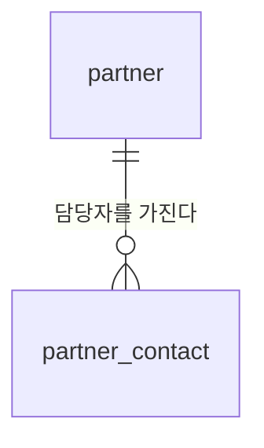

# 3. 거래처

세 번째 도메인입니다. 입고 전표(4번)가 "어디서 받았는지"로 이걸 참조합니다.

그리고 **이 프로젝트에서 논리 삭제 기본값을 깨는 첫 번째 테이블**이 여기 있습니다
([convention.md](../convention.md) 4.3이 2단계로 미뤄뒀던 개인정보 지정).

용어는 [glossary.md](glossary.md), 순서는 [scope.md](scope.md)에 있습니다.

---

## 1. 결정

| # | 정한 것 | 값 |
|---|---|---|
| 1 | 매입/매출 구분 | **지금 넣는다.** `PURCHASE` · `SALES` · `BOTH`. 당분간 전부 매입 |
| 2 | 담당자 | **별도 테이블.** 거래처 1 : 담당자 N |
| 3 | 개인정보 파기 | **거래처 미사용 후 자동 파기.** 물리 삭제 |
| 4 | 보관 기간 | **3년.** 상수가 아니라 설정값 |
| 5 | 사업자등록번호 | **있으면 받고 중복 검사.** 없어도 등록 가능 |

### 1.1 물어보지 않고 정한 것

**대표자명을 두지 않습니다.** 발주·입고에 안 쓰는데 개인사업자면 개인정보입니다. 쓰지도
않는 개인정보를 파기 대상으로 하나 더 관리할 이유가 없습니다. 세금계산서 발행이
필요해지면 그때 붙입니다.

**입금계좌·결제조건을 두지 않습니다.** 발주와 정산이 실제로 생기는 4번 입고에서 필요한
모양으로 붙입니다. 지금 넣으면 아무도 안 채우는 필드가 됩니다.

**거래처 자체는 논리 삭제를 유지합니다.** 입고 전표가 참조하므로 행을 지우면 과거 전표의
공급처가 사라집니다. 물리 삭제는 **담당자 테이블만**입니다.

---

## 2. 개념 모델

```
거래처 ──< 거래처담당자
   │
   └── 구분: 매입 / 매출 / 양쪽
```



### 2.1 거래처 `partner`

```
id            BIGINT        PK
partner_code  VARCHAR       업무코드. 고유. 불변. 비우면 자동 채번
name          VARCHAR       상호
partner_type  ENUM          PURCHASE | SALES | BOTH | DONATION
business_no   VARCHAR       NULL 허용. 있으면 고유 + 형식 검사
phone         VARCHAR       NULL 허용. 회사 대표번호
address       VARCHAR       NULL 허용
memo          TEXT          NULL 허용
active        BOOLEAN       거래 중이면 true
inactive_at   TIMESTAMPTZ   NULL 허용. 미사용으로 바꾼 시각
+ 감사 컬럼 5종
```

`partner_type` 표시 매핑 — 매입처 · 매출처 · 양쪽 · 기부처.

> `DONATION`은 9번 기부·폐기 설계에서 추가됐습니다. 기부처도 단체명 · 사업자번호 ·
> 담당자 · 연락처가 그대로 필요해 같은 테이블에 들어옵니다
> → [9-disposal.md](9-disposal.md) 2.1.

**당분간 전부 `PURCHASE`입니다.** B2B가 생기는 날 컬럼이 아니라 값만 바뀝니다.
목록 화면에는 구분 필터 칩을 두되 기본값은 매입처입니다.

`business_no`는 **NULL을 허용하되 값이 있으면 고유**입니다. 해외 샘플 업체나 개인에게
받는 경우가 있어 필수로 걸면 담당자가 가짜 번호를 넣기 시작합니다. 저장은 하이픈 없는
숫자 10자리로 정규화하고 표시할 때만 하이픈을 넣습니다 — 안 그러면 같은 업체가
`123-45-67890`과 `1234567890`으로 두 번 들어옵니다.

**`phone`은 회사 대표번호만입니다.** 사람 연락처는 담당자 테이블에 넣습니다. 여기 개인
휴대번호를 적으면 파기 대상이 두 테이블로 흩어집니다.

`inactive_at`은 파기 기산일입니다. `active`가 `false`가 되는 순간 기록하고, 다시 `true`로
돌아오면 `NULL`로 지웁니다.

### 2.2 거래처담당자 `partner_contact`

```
id            BIGINT    PK
partner_id    BIGINT    FK → partner
name          VARCHAR   이름
contact_role  ENUM      ORDER | SETTLEMENT | ETC
phone         VARCHAR   NULL 허용
email         VARCHAR   NULL 허용
is_primary    BOOLEAN   대표 담당자
memo          VARCHAR   NULL 허용
created_at · created_by · updated_at · updated_by
```

`contact_role` 표시 매핑 — 발주 · 정산 · 기타.

> **`deleted_at`이 없습니다.** 이 테이블만 감사 컬럼이 4종입니다.

논리 삭제 컬럼을 두면 "지웠는데 값은 그대로 남아 있는" 상태가 만들어지고, 그게 정확히
위반입니다. 삭제 컬럼이 아예 없어야 실수로 논리 삭제를 쓰는 코드가 안 나옵니다.

---

## 3. 파기 규칙

### 3.1 언제 지우나

| 경로 | 동작 |
|---|---|
| 담당자 행 삭제 버튼 | **즉시 물리 삭제.** 확인 대화상자 필수 |
| 거래처 `active = false` | `inactive_at` 기록 → **`inactive_at + 보관기간`이 지나면 자동 물리 삭제** |
| 거래처 다시 `active = true` | `inactive_at`을 `NULL`로. 파기 시계가 멈춥니다 |

보관 기간은 **기본 3년**이고 **설정값**입니다 (`partnerContactRetentionYears`).
상수로 박지 않는 이유는 법이나 회사 방침이 바뀔 때 배포 없이 바꿀 수 있어야 하기
때문입니다.

### 3.2 파기 로그에 남기는 것

```
남긴다    거래처 id · 지운 행 수 · 시각 · 실행 주체(배치 / 사용자)
안 남긴다  이름 · 전화번호 · 이메일
```

**"뭘 지웠는지"를 로그에 남기면 지운 게 아닙니다.** 파기 이력은 파기를 증명하는
것이지 데이터를 백업하는 게 아닙니다.

### 3.3 배치가 없는 동안

자동 파기는 스케줄러가 필요하고, 배치 실행기는 [TODO.md](../../TODO.md) 3단계에서
스택이 정해져야 만들 수 있습니다.

**그때까지는 수동입니다.** 거래처 목록에 **「파기 예정」 필터**를 둡니다 —
`active = false AND inactive_at + 보관기간 < 오늘 AND 담당자가 있음`. 담당자가 이 목록을
보고 지웁니다.

규칙은 지금 확정하고 실행만 미룹니다. 화면이 계속 보여주므로 잊히지 않습니다.

---

## 4. 채번 규칙

```
partner_code   C + 6자리 일련   C000001
```

상품(`P` + 8자리)보다 짧은 이유는 거래처 수가 두 자릿수에서 세 자릿수이기 때문입니다.
상품과 같은 규칙 — **비우면 자동, 적으면 그대로, 등록 후 변경 불가.**

---

## 5. 화면

| 화면 | 레이아웃 | 구성 |
|---|---|---|
| 거래처 목록 | **2** 좌측 필터 패널 목록 | 왼쪽에 구분 · 사용여부 · **파기 예정** 필터 |
| 거래처 등록 · 수정 | **14** 2단 폼 + 액션 사이드 | 왼쪽 기본정보 / 오른쪽 담당자 목록과 액션 |
| 거래처 상세 | **8** 탭 상세 | 기본정보 · 담당자 · 거래이력 · 변경이력 |

상품(2번)이 15번 앵커 섹션 폼을 쓴 것과 달리 거래처는 **14번**입니다. 섹션이 기본정보와
담당자 둘뿐이라 앵커 목차가 과합니다.

담당자 영역에는 **삭제 버튼이 다른 화면과 다르게 생겼습니다.** 논리 삭제가 아니라 진짜
지우는 것이므로 확인 대화상자에 "복구할 수 없습니다"를 명시합니다.

「거래이력」 탭은 4번 입고가 생긴 뒤에 채워집니다. 지금은 빈 상태(레이아웃의 `Empty`)로
둡니다.

---

## 6. 다음

4번 **입고**. 여기서 수량이 처음 움직이므로 **8번 재고와의 경계**를 확정합니다
([scope.md](scope.md) 3장). 미루면 같은 수량을 두 곳에서 관리하게 됩니다.
