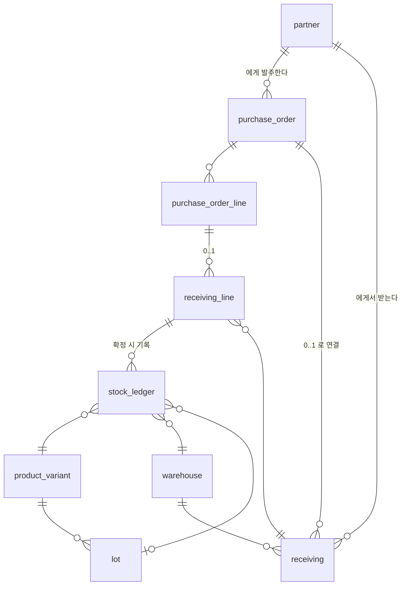

# 4. 입고

네 번째 도메인입니다. **수량이 처음 움직이는 자리**라 이 프로젝트에서 가장 많은 걸
정하는 문서입니다.

[scope.md](scope.md) 3장이 "4번에서 확정한다"고 미뤄둔 **8번 재고와의 경계**를
여기서 닫습니다.

용어는 [glossary.md](glossary.md), 표기·값 규칙은 [convention/core.md](../convention/core.md)에
있습니다.

---

## 1. 결정

| # | 정한 것 | 값 |
|---|---|---|
| 1 | 재고 표현 | **원장 + 현재고 둘 다.** 통장의 거래내역과 잔액 |
| 2 | 발주 | **발주와 입고를 둘 다.** 미입고를 화면이 들고 있는다 |
| 3 | 창고 | **테이블은 두되 지금은 「기본창고」 하나** |
| 4 | 유통기한 | **상품별 스위치.** 켠 상품만 로트 단위로 센다 |

---

## 2. 재고와의 경계 — scope.md 3장 닫힘

```
4번 입고    원장과 현재고 테이블의 주인. 수량을 늘리는 행을 쓴다
8번 재고    그 숫자를 보는 화면 + 실사 + 조정. 조정도 같은 원장에 행으로 쓴다
```

**같은 수량을 두 곳에서 관리하지 않습니다.** 테이블은 4번 것이고, 8번은 같은 테이블에
성격이 다른 행을 쓸 뿐입니다. 6번 주문의 출고도 마찬가지입니다.

수량을 건드리는 모든 도메인이 **같은 문 하나**를 지납니다.

```
입고 확정 ─┐
출고 확정 ─┼─→  재고원장 (append only)  ─→  현재고
재고 조정 ─┘
```

---

## 3. 개념 모델

```
거래처 ──< 발주 >──< 발주라인 ─┐
                                │ (참조)
창고 ──┐                        ↓
       ├──< 입고 >──< 입고라인 ─┘
로트 ──┘        │
                └─(확정)→ 재고원장 ──(합계)→ 현재고
```



### 3.1 창고 `warehouse`

```
id              BIGINT    PK
warehouse_code  VARCHAR   불변 키. 고유
name            VARCHAR
is_default      BOOLEAN   전표 화면의 기본 선택값. 하나만 true
sellable        BOOLEAN   판매 가능 재고에 포함할지
sort_order      INT
active          BOOLEAN
+ 감사 컬럼 5종
```

**지금은 `기본창고` 한 행만 넣습니다.** 화면에는 창고 선택이 안 보이고, 전표는 조용히
기본창고를 씁니다. 창고가 둘이 되는 날 행을 하나 더 넣고 선택 컨트롤을 켜면 됩니다.

`sellable`을 지금 넣는 이유는 **반품창고** 때문입니다. 반품 재고가 판매 가능 재고에
섞이면 없는 물건을 팔게 됩니다. 컬럼 하나로 막습니다.

### 3.2 로트 `lot`

```
id                 BIGINT   PK
variant_id         BIGINT   FK → product_variant
lot_no             VARCHAR  입력 없으면 자동
expiry_date        DATE     NULL 허용. 사용기한
manufactured_date  DATE     NULL 허용. 제조일
UNIQUE (variant_id, lot_no)
+ 감사 컬럼 5종
```

`product.use_lot`이 `true`인 상품의 조합에만 만듭니다 (2번 상품 테이블에 컬럼 하나
추가 — 아래 5장).

- **켠 상품**: 입고할 때 로트를 만들거나 고릅니다. 재고는 `(조합, 창고, 로트)`로 셉니다
- **끈 상품**: `lot_id`가 `NULL`입니다. 재고는 `(조합, 창고)`로 셉니다

기한이 `DATE`인 이유는 [convention/core.md](../convention/core.md) 3.1 — 시각을 붙이면
자정 경계에서 하루 밀립니다.

### 3.3 발주 `purchase_order` · `purchase_order_line`

```
purchase_order
  id                 BIGINT    PK
  purchase_order_no  VARCHAR   업무번호. 고유. PO-YYYY-0001
  partner_id         BIGINT    FK → partner (PURCHASE 또는 BOTH 만)
  order_date         DATE      발주일
  expected_date      DATE      NULL 허용. 입고 예정일
  status             ENUM      DRAFT | ORDERED | PARTIAL | COMPLETED | CANCELED
  memo               TEXT      NULL 허용
  + 감사 컬럼 5종

purchase_order_line
  id                 BIGINT         PK
  purchase_order_id  BIGINT         FK → purchase_order
  line_no            INT            줄 번호
  variant_id         BIGINT         FK → product_variant
  order_quantity     DECIMAL(18,3)  발주 수량
  unit_price         DECIMAL(18,2)  매입 단가
  received_quantity  DECIMAL(18,3)  입고된 수량 (캐시)
  memo               VARCHAR        NULL 허용
  + 감사 컬럼 5종
```

`status` 표시 매핑 — 작성중 · 발주됨 · 부분입고 · 입고완료 · 취소.

**`status`는 사람이 고르지 않고 계산됩니다.** 라인의 `received_quantity` 합에 따라
자동으로 `ORDERED → PARTIAL → COMPLETED`로 갑니다. 사람이 상태를 손으로 바꾸게 하면
그 순간 디스코드로 돌아갑니다 — "이거 처리했어요?"는 사람이 상태를 관리할 때 생기는
질문입니다.

**미입고 수량 = `order_quantity - received_quantity`.** 이게 이 도메인이 존재하는 이유고,
전용 화면을 하나 줍니다 (6장).

`line_no`를 두고 `UNIQUE (purchase_order_id, variant_id)`를 걸지 않은 이유는 같은 SKU를
단가가 다른 두 줄로 발주하는 경우가 실제로 있기 때문입니다.

### 3.4 입고 `receiving` · `receiving_line`

```
receiving
  id                 BIGINT        PK
  receiving_no       VARCHAR       업무번호. 고유. RC-YYYY-0001
  partner_id         BIGINT        FK → partner
  purchase_order_id  BIGINT        FK → purchase_order. NULL 허용
  warehouse_id       BIGINT        FK → warehouse
  received_date      DATE          입고일
  status             ENUM          DRAFT | CONFIRMED | CANCELED
  confirmed_at       TIMESTAMPTZ   NULL 허용
  confirmed_by       BIGINT        NULL 허용. account.id
  memo               TEXT          NULL 허용
  + 감사 컬럼 5종

receiving_line
  id                      BIGINT         PK
  receiving_id            BIGINT         FK → receiving
  line_no                 INT
  purchase_order_line_id  BIGINT         FK → purchase_order_line. NULL 허용
  variant_id              BIGINT         FK → product_variant
  lot_id                  BIGINT         FK → lot. NULL 허용
  quantity                DECIMAL(18,3)  입고 수량
  unit_price              DECIMAL(18,2)  매입 단가
  memo                    VARCHAR        NULL 허용
  + 감사 컬럼 5종
```

`status` 표시 매핑 — 작성중 · 확정 · 취소.

**`purchase_order_id`가 NULL을 허용합니다.** 발주 없이 그냥 받는 경우(샘플, 급하게 사온
것)가 실제로 있습니다. 발주를 강제하면 담당자가 가짜 발주서를 쓰기 시작합니다.

### 3.5 재고원장 `stock_ledger` — 통장의 거래내역

```
id              BIGINT         PK
variant_id      BIGINT         FK → product_variant
warehouse_id    BIGINT         FK → warehouse
lot_id          BIGINT         FK → lot. NULL 허용
quantity        DECIMAL(18,3)  부호 있음. + 는 늘고 − 는 줄음
source_type     ENUM           RECEIVING | SHIPPING | STOCKTAKING
                               | ADJUSTMENT | DISPOSAL
source_id       BIGINT         전표 id
source_line_id  BIGINT         NULL 허용. 전표 라인 id
reversal_of_id  BIGINT         NULL 허용. 취소로 생긴 반대 행이면 원본 id
moved_at        TIMESTAMPTZ    수량이 움직인 시각
created_at · created_by
```

> **감사 컬럼이 2종입니다.** `updated_at` · `updated_by` · `deleted_at` 이 없습니다.

**이 테이블은 append only입니다. UPDATE도 DELETE도 하지 않습니다.** 통장에서 잘못된
거래를 지우지 않는 것과 같습니다. 틀렸으면 **반대 부호 행을 하나 더 씁니다**
(`reversal_of_id`에 원본을 적어서).

수정 컬럼이 아예 없어야 실수로 UPDATE 하는 코드가 안 나옵니다 — 3번 거래처의
`partner_contact`에 `deleted_at`을 안 둔 것과 같은 이유입니다.

`source_type` 표시 매핑 — 입고 · 출고 · 실사 · 조정 · 기부폐기.
수량을 건드리는 모든 도메인이 **같은 테이블에 같은 모양으로** 씁니다.

> 처음에는 셋이었습니다. 8번에서 `STOCKTAKING`과 `ADJUSTMENT`로 나뉘었고
> ([8-stock.md](8-stock.md) 5장), 9번에서 `DISPOSAL`이 붙었습니다.
> **나누는 기준은 근거 문서가 다른가입니다** — 그래서 기부와 폐기는 같은 전표라
> 값 하나를 나눠 씁니다 ([9-disposal.md](9-disposal.md) 2.2).

### 3.6 현재고 `stock` — 통장의 잔액

```
id            BIGINT         PK
variant_id    BIGINT         FK → product_variant
warehouse_id  BIGINT         FK → warehouse
lot_id        BIGINT         FK → lot. NULL 허용
quantity      DECIMAL(18,3)  현재 수량
updated_at    TIMESTAMPTZ
UNIQUE (variant_id, warehouse_id, lot_id)
```

**원장에서 계산된 값입니다. 진실이 아니라 캐시입니다.**

```
stock.quantity = SUM(stock_ledger.quantity)  같은 (조합, 창고, 로트)
```

언제든 원장에서 다시 만들 수 있어야 하고, **재계산 기능을 화면에 둡니다**. 캐시가
틀어졌을 때 사람이 손으로 숫자를 고치는 순간 원장은 의미가 없어집니다.

> `lot_id`가 NULL일 수 있어 `UNIQUE`가 DB마다 다르게 동작합니다 (NULL은 서로 다른
> 값으로 취급되는 경우가 많음). 부분 유니크 인덱스로 갈지 대체값을 쓸지는 DB가
> 정해지는 [TODO.md](../../TODO.md) 4단계 항목입니다.

---

## 4. 전표 규칙

### 4.1 확정할 때

입고를 **확정**하면 한 트랜잭션 안에서 넷이 같이 일어납니다.

```
1. receiving.status = CONFIRMED, confirmed_at · confirmed_by 기록
2. 라인마다 stock_ledger 에 + 행 기록 (source_type = RECEIVING)
3. stock 갱신
4. 연결된 purchase_order_line.received_quantity 갱신 → purchase_order.status 재계산
```

**작성중(`DRAFT`) 전표는 재고에 아무 영향이 없습니다.** 받아서 세는 중인 것과 세기를
끝낸 것은 다릅니다.

### 4.2 고칠 때

**확정된 전표는 수정할 수 없습니다.** 취소하고 다시 씁니다.

```
취소 → 원장에 반대 부호 행 기록 (reversal_of_id = 원본 행 id)
     → stock 갱신
     → purchase_order_line.received_quantity 되돌림
     → receiving.status = CANCELED. 전표는 그대로 남는다
```

원본 원장 행도, 원본 전표도 지우지 않습니다. **"3월 5일에 10개 받았다가 3월 6일에
취소했다"가 그대로 보여야** 나중에 왜 이렇게 됐는지 답할 수 있습니다.

### 4.3 못 하게 막는 것

- 확정된 전표의 라인 추가·삭제·수정
- 이미 취소된 전표의 재취소
- `quantity = 0` 이거나 음수인 입고 라인
- 발주 라인의 잔여 수량을 초과하는 입고 — **경고만 하고 허용합니다.** 도매상이 더
  보내는 일이 실제로 있고, 막으면 담당자가 전표를 안 쓰고 넘어갑니다

---

## 5. 다른 도메인에 생기는 변화

| 문서 | 변화 |
|---|---|
| [2-product.md](2-product.md) | `product`에 `use_lot BOOLEAN` 추가 |
| [3-partner.md](3-partner.md) | 거래처 상세의 「거래이력」 탭이 여기서 채워집니다 |
| [scope.md](scope.md) | 8번 재고의 범위 확정 — 조회 · 실사 · 조정 |

---

## 6. 채번 규칙

```
purchase_order_no   PO-YYYY-0001   연도별 리셋
receiving_no       RC-YYYY-0001   연도별 리셋
lot_no             입력 없으면 입고일자 + 순번   20260903-01
warehouse_code     수기 입력
```

연도별 리셋은 [convention/core.md](../convention/core.md) 4.2가 PK와 업무번호를 분리해둔 덕에
가능합니다. 번호가 매년 1로 돌아가도 FK는 아무것도 안 건드립니다.

---

## 7. 화면

| 화면 | 레이아웃 | 구성 |
|---|---|---|
| 발주 목록 | **4** 상태별 탭 목록 | 작성중 · 발주됨 · 부분입고 · 입고완료 · 취소 |
| 발주 등록 · 수정 | **17** 전표 입력 | 헤더(거래처·발주일·예정일) + 라인 그리드 |
| **미입고 현황** | **1** 기본 목록 | 잔여 수량 > 0 인 발주 라인. 예정일 지난 건 강조 |
| 입고 목록 | **4** 상태별 탭 목록 | 작성중 · 확정 · 취소 |
| 입고 등록 · 수정 | **17** 전표 입력 | 발주 불러오기 → 라인 자동 채움 |
| 입고 상세 | **10** 이력 타임라인 상세 | 작성 → 확정 → 취소가 시각과 담당자로 |
| 창고 관리 | **18** 목록 + 모달 등록 | 창고가 하나인 동안은 거의 안 봅니다 |

**미입고 현황(1번)이 이 도메인의 심장입니다.** 설계 리트머스에 그대로 걸립니다.

> 디스코드 스크롤백 없이, 처음 보는 야간 담당자가 화면만 보고
> 지금 뭘 해야 하는지 정확히 아는가?

이 화면 하나가 "그거 언제 와요?"를 없앱니다. 예정일이 지났는데 안 온 줄은 색으로
구분하고, 거래처별로 묶어 봅니다.

**입고 상세를 10번 타임라인으로 잡은 이유**도 같습니다. 누가 언제 확정했고 누가 언제
취소했는지가 화면에 시간순으로 있어야, 그걸 물어보러 디스코드에 가지 않습니다.

입고 등록(17번)의 「발주 불러오기」는 발주 라인을 그대로 가져오고 수량만 실제 받은
값으로 고치게 합니다. 로트를 쓰는 상품이면 로트 칸이 그 줄에만 나타납니다.

---

## 8. 다음

5번 **판매채널**. 채널별 엑셀 컬럼 매핑이 6번 주문 import의 전제입니다.

```
용어사전 추가 → 개념 모델 → 화면 (레이아웃 번호) → 구현
```
