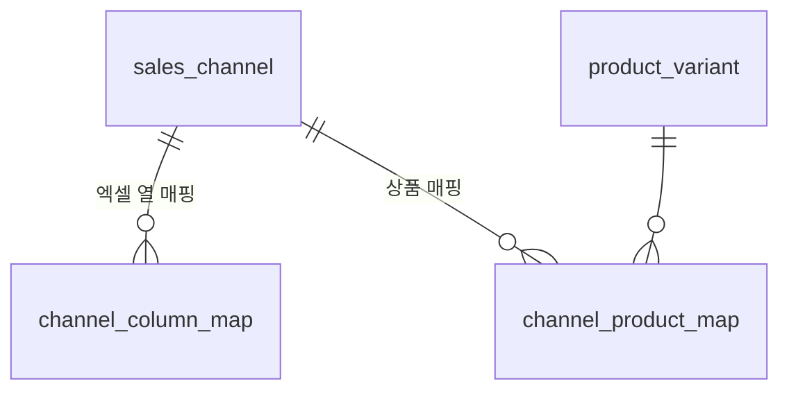

# 5. 판매채널

다섯 번째 도메인입니다. **6번 주문이 엑셀을 읽으려면 여기가 먼저 서야 합니다.**

이 문서가 정하는 건 셋입니다.

```
1. 우리가 파는 창구가 무엇인가        판매처
2. 채널 엑셀의 열이 우리 항목 어디에 붙나   엑셀 열 매핑
3. 채널 상품 문자열이 우리 SKU 어디에 붙나  채널 상품 매핑
```

용어는 [glossary.md](glossary.md)에 있습니다.

---

## 1. 결정

| # | 정한 것 | 값 |
|---|---|---|
| 1 | 채널 구조 | **판매처 한 줄 = 창구 하나.** 플랫폼 종류는 구분값 |
| 2 | 미매핑 주문 | **받아놓고 「상품 미확인」.** 붙이면 같은 문자열이 소급 연결 |
| 3 | 엑셀 열 매핑 | **DB에 저장하고 화면에서 담당자가 고친다** |

### 1.1 물어보지 않고 정한 것

**채널 수수료·정산율을 넣지 않습니다.** 지금 목적은 주문 취합이고, 정산은 이 시스템이
아직 안 하는 일입니다. 아무도 안 채우는 필드가 됩니다.

**API 연동을 지금 고려하지 않되 구조는 막지 않습니다.** v1은 엑셀 업로드입니다. 나중에
채널 API가 붙어도 엑셀 열 매핑은 그대로 두고 어댑터가 **같은 항목 키**를 채웁니다.
아래 3.2의 `field_key`가 그 접점입니다.

**주문 테이블은 여기 없습니다.** 6번 소유입니다. 여기서는 매핑 테이블과 규칙만 정하고,
주문 라인이 `variant_id`를 어떻게 들고 있을지는 6번에서 확정합니다.

---

## 2. 개념 모델

```
판매처 ──< 엑셀 열 매핑        (엑셀 헤더 → 우리 항목)
   │
   └──< 채널 상품 매핑 >── 옵션조합(SKU)
```



### 2.1 판매처 `sales_channel`

```
id             BIGINT    PK
channel_code   VARCHAR   불변 키. 고유. 수기 입력
name           VARCHAR   "스마트스토어-본점"
platform_type  ENUM      SMARTSTORE | COUPANG | ELEVENST | GMARKET
                         | AUCTION | CAFE24 | OTHER
active         BOOLEAN
sort_order     INT
memo           TEXT      NULL 허용
+ 감사 컬럼 5종
```

**한 줄이 창구 하나입니다.** 같은 스마트스토어라도 본점과 세컨드브랜드는 두 줄입니다.

`platform_type`은 표시와 집계용 구분일 뿐이고, **엑셀 매핑은 판매처 단위로 붙습니다.**
같은 플랫폼이라도 스토어마다 다운로드 설정이 달라 열 구성이 다른 경우가 있습니다.

`OTHER`를 둔 이유는 자사몰이나 전화 주문처럼 플랫폼이 아닌 창구가 실제로 생기기
때문입니다. 플랫폼 목록을 늘리려고 배포하는 일은 없어야 합니다.

### 2.2 엑셀 열 매핑 `channel_column_map`

```
id           BIGINT    PK
channel_id   BIGINT    FK → sales_channel
direction    ENUM      IMPORT | EXPORT
field_key    VARCHAR   우리 항목 키. 코드에 정의된 목록 중 하나
column_name  VARCHAR   엑셀 헤더 문자열
UNIQUE (channel_id, direction, field_key)
+ 감사 컬럼 5종
```

> `direction`은 7번 출고 설계에서 추가됐습니다. 주문을 **가져오는** 양식(`IMPORT`)과
> 발송처리를 **내보내는** 양식(`EXPORT`)이 한 테이블에 방향만 다르게 들어갑니다.
> `EXPORT` 쪽 항목은 [7-shipping.md](7-shipping.md) 4.1에 있습니다.

**방향이 메뉴와 반대입니다.** 메뉴는 DB가 마스터였지만 여기서는 `field_key`가 **코드에
고정**돼 있고 `column_name`만 DB에 있습니다.

이유는 무엇이 바뀌느냐가 다르기 때문입니다.

| | 누가 바꾸나 | 어디에 |
|---|---|---|
| `field_key` 우리 항목 | 개발자. 주문 테이블 컬럼이라 코드 없이는 못 늘림 | 코드 |
| `column_name` 엑셀 헤더 | 채널이 예고 없이 바꿈 | **DB** |

바뀌는 쪽을 DB에 뒀습니다. 그래서 "수량"이 "주문수량"으로 바뀌어도 담당자가 화면에서
고치면 그날 복구됩니다.

### 2.3 취소 문자열 `channel_cancel_status`

```
id           BIGINT    PK
channel_id   BIGINT    FK → sales_channel
status_text  VARCHAR   이 판매처에서 「취소」로 볼 채널 상태 문자열
UNIQUE (channel_id, status_text)
+ 감사 컬럼 5종
```

채널마다 문자열이 다릅니다 — `취소` `취소완료` `CANCEL` `반품접수` … 하드코딩하면
채널이 문구를 바꾸는 날 취소를 놓칩니다. 판매처마다 여러 값을 등록합니다.

> 6번 주문 설계에서 추가됐습니다. 쓰이는 규칙은
> [6-order.md](6-order.md) 5.1에 있습니다.

### 2.4 채널 상품 매핑 `channel_product_map`

```
id                    BIGINT         PK
channel_id            BIGINT         FK → sales_channel
channel_product_code  VARCHAR        채널 상품코드
channel_option_text   VARCHAR        채널 옵션 문자열. 정규화해서 저장
variant_id            BIGINT         FK → product_variant
quantity_per_unit     DECIMAL(18,3)  기본 1
mapped_at             TIMESTAMPTZ    연결한 시각
mapped_by             BIGINT         연결한 사람. account.id
UNIQUE (channel_id, channel_product_code, channel_option_text)
+ 감사 컬럼 5종
```

**`quantity_per_unit`** — 채널에서 "2개입"으로 파는데 우리 SKU는 1개일 때 씁니다.
채널 1개 주문 = 우리 SKU 2개 차감. 2번의 세트와 다른 경우입니다 — 세트는 **여러 SKU**,
이건 **같은 SKU의 배수**입니다.

**`channel_option_text`는 정규화해서 저장합니다.**

```
앞뒤 공백 제거 · 연속 공백은 하나로 · 전각 문자는 반각으로
```

안 하면 `"빨강 / L"` 과 `"빨강/L"` 이 서로 다른 매핑이 되고, 같은 상품이 미확인
목록에 두 번 뜹니다. 원문은 주문 라인에 그대로 남기고(6번), 매핑 키만 정규화합니다.

---

## 3. 우리 항목 키 `field_key`

코드에 고정된 목록입니다. **초안이고 6번 주문 설계에서 확정합니다** — 주문 테이블
컬럼과 1:1이어야 하기 때문입니다.

| `field_key` | 업무용어 | 필수 |
|---|---|---|
| `CHANNEL_ORDER_NO` | 채널 주문번호 | ● |
| `CHANNEL_ORDER_LINE_NO` | 채널 주문상세번호 | |
| `ORDERED_AT` | 주문 일시 | ● |
| `CHANNEL_PRODUCT_CODE` | 채널 상품코드 | ● |
| `CHANNEL_PRODUCT_NAME` | 채널 상품명 | |
| `CHANNEL_OPTION_TEXT` | 채널 옵션 문자열 | ● |
| `QUANTITY` | 수량 | ● |
| `ORDER_AMOUNT` | 결제 금액 | |
| `RECEIVER_NAME` | 수령인 | ● |
| `RECEIVER_PHONE` | 수령인 연락처 | ● |
| `RECEIVER_ZIPCODE` | 우편번호 | |
| `RECEIVER_ADDRESS` | 주소 | ● |
| `DELIVERY_MESSAGE` | 배송 메시지 | |

필수 항목이 하나라도 매핑되지 않은 판매처는 **업로드 버튼이 잠깁니다.** 파일을 읽다가
중간에 터지는 것보다 시작 전에 막는 게 낫습니다.

> **수령인 정보는 개인정보입니다.** 보관·파기 정책은 6번 주문에서 정합니다
> ([convention.md](../convention.md) 4.3의 지정 대상). 여기서는 매핑 키만 정의합니다.

---

## 4. 미매핑 주문 처리

이 도메인이 존재하는 이유입니다.

### 4.1 흐름

```
엑셀 업로드
   ↓
채널 상품코드 + 옵션문자열로 매핑 조회
   ↓
있음 → 주문 라인에 variant_id 연결
없음 → variant_id = NULL, 「상품 미확인」으로 표시하고 주문은 받아들인다
   ↓
담당자가 미확인 화면에서 SKU를 붙임
   ↓
1. channel_product_map 에 행 생성
2. 같은 (판매처, 상품코드, 옵션문자열) 을 가진 미확인 주문 라인을 전부 소급 연결
```

**핵심은 2번입니다.** 한 번 붙이면 과거 줄까지 같이 풀립니다. 매번 손으로 붙이면
사람이 금방 안 하게 되고, 그러면 이 화면은 죽습니다.

### 4.2 미확인 상태에서 되는 것 · 안 되는 것

| | |
|---|---|
| 된다 | 주문 접수 · 목록 조회 · 수령인 확인 · 채널 원문 확인 |
| 안 된다 | 출고 · 송장 발행 · 재고 차감 |

재고는 출고 확정 때 움직입니다(7번). 상품이 확정 안 된 줄은 출고 대상에서 빠지고
**「상품 미확인 N건」이 계속 화면에 보입니다.** 설계 리트머스가 요구하는 것이 이겁니다.

> 디스코드 스크롤백 없이, 처음 보는 야간 담당자가 화면만 보고
> 지금 뭘 해야 하는지 정확히 아는가?

---

## 5. 화면

| 화면 | 레이아웃 | 구성 |
|---|---|---|
| 판매처 관리 | **18** 목록 + 모달 등록 | 필드가 적어 별도 페이지가 과함 |
| 엑셀 열 매핑 | **7** 마스터-디테일 | 왼쪽 판매처 / 오른쪽 「우리 항목 → 엑셀 열」 표 |
| **상품 미확인 처리** | **11** 3분할 | 왼쪽 미확인 목록 / 가운데 채널 원문 / 오른쪽 상품 검색·연결 |
| 상품 매핑 목록 | **3** 상세 조회 목록 | 이미 연결된 매핑 검색. 잘못 붙인 것 수정 |

**상품 미확인 처리(11번)가 이 도메인의 심장입니다.** 3분할인 이유는 셋을 동시에 봐야
하기 때문입니다 — 처리할 목록, 채널이 준 원문 그대로, 우리 상품 검색창. 한 화면에서
읽고 찾고 붙이는 게 끝나야 합니다.

엑셀 열 매핑(7번)은 1번의 역할 관리, 2번의 옵션 마스터와 같은 레이아웃입니다. 새 파일을
올리면 **헤더를 읽어 후보를 제시**하고 담당자는 바뀐 열만 고칩니다.

---

## 6. 다음

6번 **주문**. 원래 목적입니다.

여기서 정할 것 — 상태 목록 · 개인정보(수령인) 정책 · 재import 시 컬럼 소유권 ·
취소 감지 · 낙관적 잠금. 이전 초안
([prior-design-2026-09-02.md](prior-design-2026-09-02.md))에 밀도 높은 안이 있고
[scope.md](scope.md) 4장에서 "살림"으로 판정해뒀습니다. 그걸 출발점으로 씁니다.
