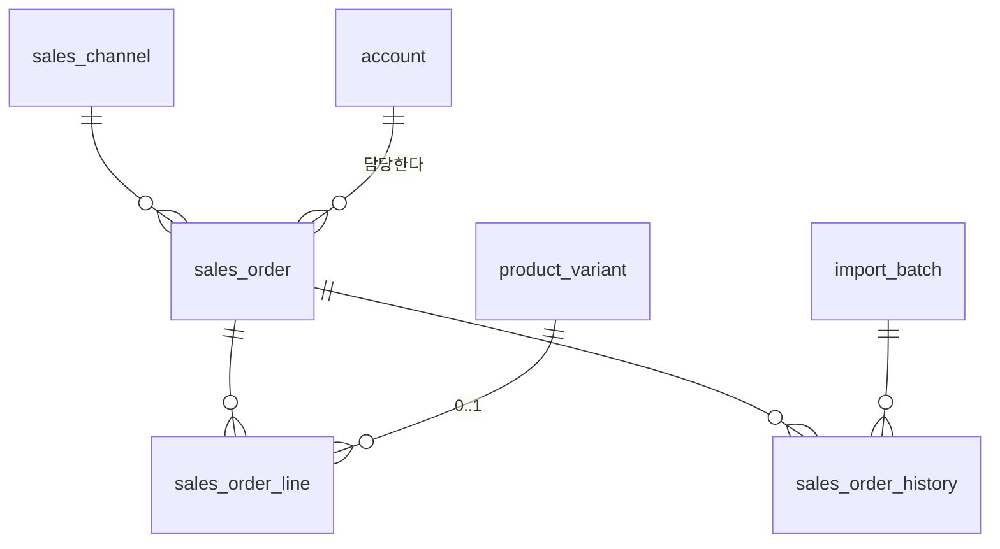

# 6. 주문

**원래 목적입니다.** 앞의 다섯 도메인은 전부 이 문서를 쓰기 위해 세운 것입니다.

만들 것은 ERP 화면이 아니라 **주문 행의 상태 · 담당자 · 시각을 권위 있게 보유하고
교대 경계를 넘어 살아남는 공유 운영 상태 계층**입니다 ([scope.md](scope.md) 1장).

이전 초안([prior-design-2026-09-02.md](prior-design-2026-09-02.md))에서 "살림"으로
판정한 것들 — 재import 컬럼 소유권 · 취소 감지 규칙 · 낙관적 잠금 · 배치 골격 —
을 지금 구조에 맞춰 옮겼습니다.

---

## 1. 결정

| # | 정한 것 | 값 |
|---|---|---|
| 1 | 상태 | **5개.** 접수 · 확인 · 출고대기 · 출고완료 · 보류 |
| 2 | 취소 | **상태가 아니라 별도 축.** 채널이 알려주는 사실 |
| 3 | 부분출고 | **주문 단위로 출고.** 단 라인은 키로 매칭해 보존 |
| 4 | 수령인 정보 | **주문과 분리해 파기.** 출고완료 후 5년(설정값) |
| 5 | 채널 원본 | **수령인 열을 뺀 채로 저장** |

---

## 2. 상태

### 2.1 운영 상태 `status`

```
접수 ──→ 확인 ──→ 출고대기 ──→ 출고완료
 │        │         │
 └────────┴─────────┴──→ 보류 ──→ (되돌아올 수 있음)
```

| 코드값 | 표시 | 뜻 |
|---|---|---|
| `RECEIVED` | 접수 | 엑셀로 들어옴. 아직 아무도 안 봄 |
| `CONFIRMED` | 확인 | 사람이 보고 이상 없음을 확인함 |
| `READY` | 출고대기 | 상품이 다 확정됐고 재고가 있음. 포장하면 됨 |
| `SHIPPED` | 출고완료 | 실제로 나감. **7번 출고 확정으로만 도달** |
| `HOLD` | 보류 | 품절 · 입고대기 · 고객 문의 등으로 멈춤 |

**`SHIPPED`는 사람이 직접 고를 수 없습니다.** 7번 출고 전표를 확정할 때만 됩니다.
손으로 바꿀 수 있게 하면 재고가 안 깎인 채 출고완료가 되고, 그 순간 재고는 시트
시절로 돌아갑니다.

**`READY`로 갈 수 있는 조건**

```
모든 라인의 variant_id 가 채워져 있고 (상품 미확인이 없고)
canceled_at 이 NULL 이다 (취소되지 않았다)
```

`HOLD`는 어느 상태에서든 갈 수 있고 돌아올 수 있습니다. 왜 멈췄는지는 `memo`에
적습니다.

### 2.2 취소는 상태가 아닙니다

취소는 **우리가 정하는 게 아니라 채널이 알려주는 사실**입니다. 그래서 `status`와
축이 다릅니다.

```
status      우리가 관리한다.     접수 → 확인 → 출고대기 → 출고완료
canceled_at  채널이 알려준다.     NULL 이거나, 취소를 감지한 시각
```

한 축으로 합치면 "확인까지 했는데 취소된 주문"을 표현할 방법이 없어집니다. 그리고
그게 정확히 **사고가 나는 지점**입니다 — 취소된 걸 모르고 보내는 것.

`canceled_at IS NOT NULL`인 주문은 목록에서 **취소 배지**가 붙고 **출고·송장 액션이
잠깁니다.**

---

## 3. 개념 모델

```
판매처 ──< 주문 ──< 주문라인 >── 옵션조합(SKU)
            │  │
            │  └──< 주문이력
            │
        수집배치
```



### 3.1 주문 `sales_order`

```
id                  BIGINT         PK
channel_id          BIGINT         FK → sales_channel
channel_order_no    VARCHAR        채널 주문번호
ordered_at          TIMESTAMPTZ    주문 일시
channel_status      VARCHAR        채널 원본 상태 문자열
status              ENUM           RECEIVED | CONFIRMED | READY | SHIPPED | HOLD
assignee_id         BIGINT         NULL 허용. 담당자. account.id
canceled_at         TIMESTAMPTZ    NULL 허용. 취소를 감지한 시각
needs_review        BOOLEAN        직전 배치엔 있었는데 이번에 안 보인 주문
order_amount        DECIMAL(18,2)  NULL 허용
memo                TEXT           NULL 허용. 사람이 쓰는 운영 메모
version             INT            낙관적 잠금
raw_data            JSON           채널 원본 행. 수령인 열 제외
─── 개인정보 ───
receiver_name       VARCHAR        NULL 허용
receiver_phone      VARCHAR        NULL 허용
receiver_zipcode    VARCHAR        NULL 허용
receiver_address    VARCHAR        NULL 허용
delivery_message    VARCHAR        NULL 허용
receiver_purged_at  TIMESTAMPTZ    NULL 허용. 수령인 정보를 지운 시각
─────────────────
+ 감사 컬럼 5종
UNIQUE (channel_id, channel_order_no)
```

`UNIQUE (channel_id, channel_order_no)`가 **중복 import를 원천 차단**합니다. 같은 파일을
두 번 올려도 주문이 두 배가 되지 않습니다.

`channel_status`는 채널이 준 문자열을 **가공 없이** 담습니다. 취소 감지의 유일한
근거라서 해석해서 넣으면 근거가 사라집니다.

### 3.2 주문라인 `sales_order_line`

```
id                     BIGINT         PK
sales_order_id         BIGINT         FK → sales_order
match_key              VARCHAR        재import 매칭 키
line_no                INT            표시 순서
channel_order_line_no  VARCHAR        NULL 허용. 채널 주문상세번호
channel_product_code   VARCHAR        채널 상품코드 원문
channel_product_name   VARCHAR        NULL 허용
channel_option_text    VARCHAR        채널 옵션 문자열 원문 (정규화 전)
variant_id             BIGINT         FK → product_variant. NULL 이면 상품 미확인
quantity               DECIMAL(18,3)  채널이 준 수량
variant_quantity       DECIMAL(18,3)  quantity × quantity_per_unit. 실제 차감 수량
line_amount            DECIMAL(18,2)  NULL 허용
+ 감사 컬럼 5종
UNIQUE (sales_order_id, match_key)
```

**`match_key`가 "줄을 살려두는" 장치입니다.**

```
channel_order_line_no 가 있으면   → 그 값
없으면                        → channel_product_code + 정규화한 channel_option_text
```

재import할 때 라인을 **전삭제하지 않고** 이 키로 찾아 갱신합니다. 그래서 나중에
라인 단위 상태(부분출고)가 필요해져도 붙일 자리가 이미 있습니다.

`channel_option_text`는 **원문 그대로** 둡니다. 매핑 조회에 쓰는 정규화 값과 다릅니다
([5-channel.md](5-channel.md) 2.3) — 원문이 있어야 채널이 뭘 줬는지 눈으로 봅니다.

`variant_quantity`를 따로 두는 이유는 채널 1개 = 우리 2개인 경우(`quantity_per_unit`)
때문입니다. 재고에서 빠지는 건 이 값입니다.

### 3.3 주문이력 `sales_order_history`

```
id              BIGINT        PK
sales_order_id  BIGINT        FK → sales_order
changed_at      TIMESTAMPTZ
changed_by      BIGINT        NULL 허용. 배치가 바꿨으면 NULL
field           VARCHAR       바뀐 항목
old_value       VARCHAR
new_value       VARCHAR
source          ENUM          IMPORT | MANUAL | SYSTEM
batch_id        BIGINT        NULL 허용. FK → import_batch
created_at · created_by
```

> **감사 컬럼이 2종입니다.** `stock_ledger`와 같은 append only 테이블입니다.

**기록하는 항목은 화이트리스트입니다.**

```
status · assignee_id · memo · canceled_at · needs_review
```

**수령인 정보는 이력에 남기지 않습니다.** 남기면 5년 뒤에 본체를 지워도 이력에
그대로 남아, 파기한 게 아니게 됩니다. 원본 보존에서 수령인 열을 뺀 것과 같은
이유입니다.

이력이 이 프로젝트의 존재 이유입니다 — 디스코드가 하던 "누가 언제 뭘 했나"가
여기로 옮겨옵니다.

### 3.4 수집배치 `import_batch`

```
id              BIGINT        PK
channel_id      BIGINT        FK → sales_channel
file_name       VARCHAR
imported_at     TIMESTAMPTZ
imported_by     BIGINT        account.id
total_count     INT           읽은 행 수
new_count       INT           새로 만든 주문
updated_count   INT           갱신한 주문
canceled_count  INT           이번에 취소로 바뀐 주문
skipped_count   INT           변화 없어 건너뛴 주문
error_count     INT           오류
missing_count   INT           직전 배치엔 있었는데 이번에 없던 주문
+ created_at · created_by
```

> 초안은 안 보인 주문을 `missing_order_ids` 배열 컬럼에 담았습니다. **배열 대신
> 주문 쪽 `needs_review` 플래그로 바꿨습니다** — 배열 타입은 DB마다 지원이 달라
> 스택이 정해지기 전에 쓰면 4단계에서 다시 씁니다.

---

## 4. 재import 규칙

같은 채널의 엑셀은 매일 다시 올라옵니다. **무엇을 덮어쓰고 무엇을 지킬지**가 이
도메인에서 가장 자주 사고가 나는 곳입니다.

### 4.1 컬럼 소유권

| 소유 | 컬럼 | 재import 시 |
|---|---|---|
| **채널** | `channel_status` `ordered_at` `order_amount` `raw_data`, 수령인 5종, `sales_order_line`의 채널 필드 전부 | **덮어씀** |
| **운영** | `status` `assignee_id` `memo` `canceled_at` `needs_review` | **지킴** |
| **파생** | `variant_id` `variant_quantity` | 매핑에서 다시 계산 |

**운영 컬럼을 지키는 것이 이 표의 전부입니다.** 담당자가 아침에 20건을 확인해뒀는데
오후 재import가 그걸 접수로 되돌리면, 그날부터 아무도 이 시스템을 안 씁니다.

### 4.2 파기된 수령인은 되살리지 않습니다

```
receiver_purged_at IS NOT NULL 인 주문은 수령인 5종을 덮어쓰지 않는다
```

이 한 줄이 없으면 5년 뒤 파기한 개인정보를 옛날 파일 재업로드가 되살립니다.
**파기 규칙이 있는데 이 예외가 없으면 파기는 없는 것과 같습니다.**

### 4.3 라인 매칭

```
1. match_key 로 기존 라인을 찾는다
2. 있으면 갱신, 없으면 추가
3. 이번 파일에 없는 기존 라인은 지우지 않고 표시만 한다
```

3번을 지우지 않는 이유는 2.2와 같습니다 — **없어진 게 취소인지 파일 문제인지 모릅니다.**

---

## 5. 취소 감지

성공 여부가 이 두 줄에 걸려 있습니다.

### 5.1 채널 상태 문자열로 감지

```
channel_status 가 그 판매처의 「취소로 간주할 문자열」 집합에 속하고
AND canceled_at IS NULL 이면
→ canceled_at = 지금
```

**`canceled_at IS NULL` 조건이 핵심입니다.** 이건 집합 소속이 아니라 **상태 전이**입니다.
이 조건이 없으면 이미 취소된 주문이 재import마다 다시 "취소 전환"으로 발화하고
`canceled_at`이 매번 오늘로 갱신됩니다.

취소 문자열은 채널마다 다릅니다 — `취소` `취소완료` `CANCEL` `반품접수` … 하드코딩하지
않고 판매처에 붙입니다. `channel_cancel_status` 테이블을 5번 문서에 추가했습니다.

### 5.2 안 보이는 행은 자동 취소하지 않습니다

```
직전 배치엔 있었는데 이번 배치에 없는 주문
→ 자동 취소 안 함
→ needs_review = true. 「오늘 할 일」에 뜬다
```

엑셀 export 기간 필터를 잘못 잡아도 행이 사라집니다. **없어진 것과 취소된 것은
다릅니다.** 자동으로 취소 처리하면 멀쩡한 주문이 조용히 죽습니다.

---

## 6. 동시 편집

5명이 교대로 쓰므로 동시 접속은 보통 한둘입니다. 무겁게 잠그지 않고 **낙관적
잠금**으로 갑니다.

```
화면이 들고 있던 version ≠ DB의 version
→ 저장 거부. "다른 사람이 먼저 바꿨습니다" + 최신값을 보여준다
```

**벌크 처리는 전체를 되돌리지 않습니다.**

```
20건 일괄 상태변경 중 3건이 stale
→ 17건은 반영. 3건은 실패 목록으로 보여주고 다시 시도하게 한다
```

전체 롤백하면 담당자가 왜 아무것도 안 됐는지 모른 채 같은 작업을 반복합니다.

---

## 7. 수령인 정보 파기

[convention/core.md](../convention/core.md) 4.3의 **두 번째 지정 대상**입니다
(첫 번째는 `partner_contact`).

| | |
|---|---|
| 대상 | `receiver_name` `receiver_phone` `receiver_zipcode` `receiver_address` `delivery_message` |
| 시점 | `status = SHIPPED` 가 된 날부터 **5년** (설정값 `orderReceiverRetentionYears`) |
| 방법 | 다섯 컬럼을 `NULL`로. `receiver_purged_at` 기록 |
| 남는 것 | 주문 · 금액 · 상품 · 수량 · 상태 · 이력 — **집계는 그대로 됩니다** |

`partner_contact`와 다르게 **행을 지우지 않습니다.** 주문 행은 집계와 정산에 계속
필요하고, 개인정보는 그 안의 다섯 칸뿐입니다.

파기 로그는 3번과 같습니다 — **주문 id · 건수 · 시각 · 실행 주체만.** 지운 값은
안 남깁니다.

> 자동 파기는 배치가 필요하고 배치 실행기는 [TODO.md](../../TODO.md) 3단계입니다.
> 그때까지는 주문 목록의 **「파기 예정」 필터**로 수동 처리합니다.
> 3번 거래처와 같은 방식입니다.

---

## 8. 다른 도메인에 생기는 변화

| 문서 | 변화 |
|---|---|
| [5-channel.md](5-channel.md) | `channel_cancel_status` 테이블 추가 (취소로 간주할 문자열) |
| [convention/core.md](../convention/core.md) | 4.3 개인정보 지정표에 `sales_order` 수령인 5종 추가 |
| [scope.md](scope.md) | 4장의 "상태 값 목록 미확정" → 확정 |

---

## 9. 화면

| 화면 | 레이아웃 | 구성 |
|---|---|---|
| **오늘 할 일** | **24** 결재함 | 손이 필요한 것만: 상품 미확인 · 취소 감지 · 안 보인 주문 |
| 주문 목록 | **4** 상태별 탭 목록 | 상태 탭 + 다중선택 + 벌크 상태·담당 변경 |
| 주문 상세 | **10** 이력 타임라인 상세 | 라인 · 수령인 · **이력이 시간순으로** |
| 엑셀 업로드 | **16** 단계 입력 위저드 | 파일 선택 → 미리보기·검증 → 커밋 |
| 업로드 이력 | **1** 기본 목록 | 배치별 신규·갱신·취소·오류 건수 |

### 9.1 「오늘 할 일」이 리트머스입니다

> 디스코드 스크롤백 없이, 처음 보는 야간 담당자가 화면만 보고
> 지금 뭘 해야 하는지 정확히 아는가?

이 화면 하나로 답합니다. 여기 뜨는 건 셋뿐입니다.

```
상품 미확인   variant_id 가 NULL 인 라인이 있는 주문
취소 감지     canceled_at 이 최근에 세팅됐는데 아직 status 가 SHIPPED 가 아닌 주문
안 보인 주문   needs_review = true
```

**전부 "사람이 판단해야 하는 것"입니다.** 기계가 알아서 할 수 있는 건 여기 안
올라옵니다.

### 9.2 업로드는 위저드입니다

16번을 쓴 이유는 **커밋 전에 보여줘야** 하기 때문입니다.

```
1단계  파일 선택 → 판매처 선택
2단계  헤더 검증 · 신규 N · 갱신 M · 취소전환 K · 오류 E · 상품 미확인 P 를 미리 보여줌
3단계  커밋
```

2단계에서 멈출 수 있어야 잘못된 파일을 되돌리는 일이 안 생깁니다.

### 9.3 주문 상세를 10번으로 잡은 이유

라인이나 수령인보다 **이력이 주인공**이기 때문입니다. 누가 언제 상태를 바꿨고 어느
배치가 뭘 덮어썼는지가 시간순으로 있어야, 그걸 물어보러 디스코드에 가지 않습니다.

---

## 10. 다음

7번 **출고 · 송장**. `SHIPPED`로 가는 유일한 문이고, 재고원장에 `SHIPPING` 행을
쓰는 곳입니다.
