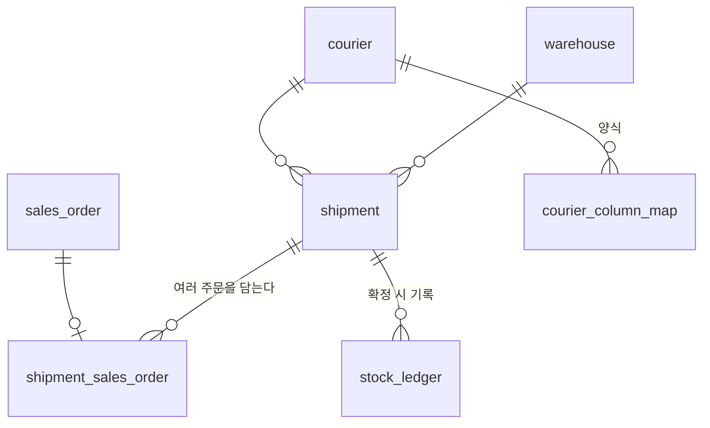

# 7. 출고 · 송장

일곱 번째 도메인입니다. 두 가지가 여기서만 일어납니다.

```
주문이 SHIPPED 로 가는 유일한 문
재고원장에 SHIPPING 행이 쓰이는 유일한 곳
```

용어는 [glossary.md](glossary.md)에 있습니다.

---

## 1. 결정

| # | 정한 것 | 값 |
|---|---|---|
| 1 | 출고 전표 | **둔다.** 출고 1건 = 박스 1개 = 송장 1개, 주문은 여러 건 |
| 2 | 재고 부족 | **경고하고 보내되 「재고 확인 필요」에 올린다** |
| 3 | 송장 | **엑셀 왕복.** 택배사 양식은 DB에 두고 담당자가 고친다 |

### 1.1 물어보지 않고 정한 것

**출고 라인 테이블을 두지 않습니다.** 주문 단위 전량 출고라 주문라인이 곧 출고
내역입니다. 원장은 `source_id = 출고 id`, `source_line_id = 주문라인 id`로 가리킵니다.
부분출고를 하게 되면 그때 생깁니다 ([6-order.md](6-order.md) 1장의 결정 3).

**로트는 사용기한이 빠른 것부터 자동으로 뺍니다.** 담당자가 화면에서 바꿀 수 있지만
기본값은 선입선출입니다. 고르게 만들면 매번 고르지 않고, 그러면 기한 임박분이 창고
뒤에 계속 남습니다.

---

## 2. 개념 모델

```
주문(READY) ──< 출고-주문 >── 출고 ──── 택배사
                               │
                               ├─(확정)→ 재고원장 SHIPPING 행 → 현재고
                               └─ 송장번호
```



### 2.1 택배사 `courier` · 양식 `courier_column_map`

```
courier
  id            BIGINT   PK
  courier_code  VARCHAR  불변 키. 고유
  name          VARCHAR
  sort_order    INT
  active        BOOLEAN
  + 감사 컬럼 5종

courier_column_map
  id           BIGINT    PK
  courier_id   BIGINT    FK → courier
  direction    ENUM      EXPORT | IMPORT
  field_key    VARCHAR   우리 항목 키. 코드에 고정
  column_name  VARCHAR   엑셀 열 이름
  sort_order   INT
  UNIQUE (courier_id, direction, field_key)
  + 감사 컬럼 5종
```

**5번 판매처의 엑셀 열 매핑과 같은 구조입니다** ([5-channel.md](5-channel.md) 2.2).
`field_key`는 코드에 고정, `column_name`만 DB — 바뀌는 쪽만 DB에 둡니다.

`direction`이 하나 늘었습니다. 내보내는 양식(우리 → 택배사)과 받는 양식
(택배사 → 우리)이 다르기 때문입니다.

| `direction` | `field_key` |
|---|---|
| `EXPORT` | `SHIPMENT_NO` `RECEIVER_NAME` `RECEIVER_PHONE` `RECEIVER_ZIPCODE` `RECEIVER_ADDRESS` `DELIVERY_MESSAGE` `ITEM_SUMMARY` `BOX_COUNT` |
| `IMPORT` | `SHIPMENT_NO` `TRACKING_NO` |

**`SHIPMENT_NO`가 양쪽에 다 있는 게 핵심입니다.** 우리 출고번호를 실어 보내고 그대로
돌려받아야 매칭됩니다. 수령인 이름으로 맞추면 동명이인에서 바로 틀어집니다.

### 2.2 출고 `shipment`

```
id                BIGINT        PK
shipment_no       VARCHAR       업무번호. 고유. SH-YYYY-0001
warehouse_id      BIGINT        FK → warehouse
shipped_date      DATE          출고일
status            ENUM          DRAFT | CONFIRMED | CANCELED
courier_id        BIGINT        FK → courier. NULL 허용
tracking_no       VARCHAR       NULL 허용. 송장번호
tracking_at       TIMESTAMPTZ   NULL 허용. 송장번호가 붙은 시각
channel_notified  BOOLEAN       채널 발송처리 파일에 실렸는지
confirmed_at      TIMESTAMPTZ   NULL 허용
confirmed_by      BIGINT        NULL 허용. account.id
memo              TEXT          NULL 허용
+ 감사 컬럼 5종
UNIQUE (courier_id, tracking_no)   tracking_no 가 있을 때만
```

`status` 표시 매핑 — 작성중 · 확정 · 취소. 입고 전표와 같습니다.

`channel_notified`가 필요한 이유는 **채널에 발송처리를 안 하면 고객 화면에 배송중이
안 뜨기 때문**입니다. 송장은 붙었는데 채널에 안 올린 건은 그 자체로 할 일입니다.

### 2.3 출고-주문 `shipment_sales_order`

```
id              BIGINT    PK
shipment_id     BIGINT    FK → shipment
sales_order_id  BIGINT    FK → sales_order
canceled        BOOLEAN   출고가 취소되면 true
+ 감사 컬럼 5종
UNIQUE (sales_order_id)   canceled = false 인 것만
```

`UNIQUE (sales_order_id)`가 **같은 주문을 두 번 출고하는 것을 DB가 막습니다.** 애플리케이션
검사만으로는 두 사람이 동시에 누르면 뚫립니다.

**`canceled`는 의도적인 중복입니다.** 취소 여부는 `shipment.status`에 있는데, 부분
유니크 인덱스는 다른 테이블을 참조할 수 없습니다. 취소된 연결도 이력으로 남겨야
하므로, 그 조건을 이 테이블로 가져옵니다.

```sql
create unique index ux_shipment_sales_order__active
  on shipment_sales_order (sales_order_id) where canceled = false;
```

3.4에서 출고를 취소할 때 이 값을 같이 세웁니다. 근거는
[convention/stack.md](../convention/stack.md) 3.6.

---

## 3. 확정과 취소

### 3.1 확정할 때

한 트랜잭션 안에서 다섯이 같이 일어납니다.

```
1. shipment.status = CONFIRMED, confirmed_at · confirmed_by 기록
2. 담긴 주문의 모든 주문라인에 대해 stock_ledger 에 − 행 기록
     세트(is_set)면 구성품으로 전개해서 기록
     로트 상품이면 사용기한이 빠른 로트부터
3. stock 갱신
4. 담긴 주문의 status = SHIPPED
5. 음수가 된 (조합, 창고, 로트)를 「재고 확인 필요」로 표시
```

**2번의 세트 전개가 2번 상품 도메인과 이어지는 지점입니다.** 세트는 자기 재고를 갖지
않으므로([2-product.md](2-product.md) 2.7) 여기서 구성품 수량으로 펼쳐 기록합니다.
`구성 수량 × 주문 차감 수량`이 각 구성품에서 빠집니다.

### 3.2 확정할 수 없는 조건

```
주문이 취소됨            canceled_at IS NOT NULL
상품 미확인 라인이 있음   variant_id IS NULL
주문 상태가 READY 가 아님
이미 다른 출고에 담김
```

첫 줄이 [6-order.md](6-order.md) 2.2가 존재하는 이유입니다 — **취소된 걸 모르고
보내는 것**이 이 시스템이 막으려는 사고입니다.

### 3.3 재고가 모자랄 때

**막지 않습니다.** 경고를 띄우고, 확정하면 재고가 음수로 내려갑니다.

도입 초기에는 시스템 숫자만 틀린 경우가 반드시 생깁니다. 여기서 막으면 담당자는
물건이 눈앞에 있는데 못 보내고, **시스템을 우회해서 보냅니다.** 그때부터 기록이
끊기고 재고는 더 틀어집니다.

대신 음수가 난 SKU는 **「재고 확인 필요」 목록**에 올라가 8번 재고의 실사로
이어집니다. 물건은 나가고 숫자는 나중에 맞춥니다.

### 3.4 취소할 때

입고와 같은 방식입니다 ([4-receiving.md](4-receiving.md) 4.2).

```
원장에 반대 부호 행 기록 (reversal_of_id = 원본 행 id)
stock 갱신
담긴 주문의 status 를 READY 로 되돌림
shipment.status = CANCELED. 전표와 연결은 그대로 남는다
shipment_sales_order.canceled = true  ← 그 주문을 다시 출고할 수 있게 됨
```

**송장번호는 지우지 않습니다.** 실제로 발행된 번호이고, 택배사에 그 번호로 물건이
접수됐을 수 있습니다. 지우면 그 사실을 추적할 방법이 없어집니다.

---

## 4. 엑셀 왕복

```
1. 출고 대기 목록에서 주문을 골라 출고 전표 생성 (합포장이면 여러 건을 한 전표에)
2. 택배사 양식으로 내보내기        SHIPMENT_NO 를 실어 보낸다
3. 택배사가 송장 발행
4. 송장번호 파일 업로드            SHIPMENT_NO 로 매칭 → tracking_no · tracking_at 기록
5. 채널 발송처리 양식으로 내보내기   channel_notified = true
```

2번과 5번은 파일이 **시스템 밖으로 나갑니다.** 그리고 그 안에 수령인 정보가 들어
있습니다. 그래서 내보내기 기록을 남깁니다.

```
shipment_export
  id           BIGINT        PK
  export_type  ENUM          COURIER | CHANNEL
  courier_id   BIGINT        NULL 허용
  channel_id   BIGINT        NULL 허용
  file_name    VARCHAR
  row_count    INT
  exported_at  TIMESTAMPTZ
  exported_by  BIGINT        account.id
  + created_at · created_by
```

**남기는 건 누가·언제·몇 건인지까지입니다.** 내보낸 내용은 남기지 않습니다 —
3번·6번의 파기 로그와 같은 원칙입니다. 뭘 내보냈는지를 저장하면 그게 또 하나의
개인정보 사본이 됩니다.

`receiver_purged_at`이 찍힌 주문은 내보낼 수 없습니다. 지운 값을 다시 파일로 꺼내는
일은 없어야 합니다.

### 4.1 채널 발송처리 양식

5번의 `channel_column_map`에 `direction`을 추가했습니다. 주문을 **가져오는** 양식과
발송처리를 **내보내는** 양식이 한 테이블에 방향만 다르게 들어갑니다.

| `direction` | `field_key` |
|---|---|
| `IMPORT` | 5번 3장의 주문 항목들 |
| `EXPORT` | `CHANNEL_ORDER_NO` `TRACKING_NO` `COURIER_CODE` `SHIPPED_DATE` |

---

## 5. 다른 도메인에 생기는 변화

| 문서 | 변화 |
|---|---|
| [5-channel.md](5-channel.md) | `channel_column_map`에 `direction` 추가 |
| [6-order.md](6-order.md) | `SHIPPED` 도달 경로가 여기로 확정 |
| [4-receiving.md](4-receiving.md) | `stock_ledger`의 `SHIPPING` 행을 쓰는 곳이 여기 |

---

## 6. 채번 규칙

```
shipment_no   SH-YYYY-0001   연도별 리셋
courier_code  수기 입력
```

입고(`RC-`) · 발주(`PO-`)와 같은 규칙입니다.

---

## 7. 화면

| 화면 | 레이아웃 | 구성 |
|---|---|---|
| **출고 대기** | **5** 그룹 목록 | `READY` 주문을 **수령인 기준으로 묶어** 보여줌 → 선택해서 출고 생성 |
| 출고 목록 | **4** 상태별 탭 목록 | 작성중 · 확정 · 취소 + 「송장 없음」 「채널 미통보」 필터 |
| 출고 상세 | **9** 요약 사이드 상세 | 담긴 주문 목록 + 사이드에 송장·택배사·상태 |
| 송장번호 업로드 | **16** 단계 입력 위저드 | 파일 → 매칭 미리보기 → 커밋 |
| 택배사 · 양식 관리 | **7** 마스터-디테일 | 왼쪽 택배사 / 오른쪽 양식 매핑 (방향별) |

### 7.1 출고 대기를 5번 그룹 목록으로 잡은 이유

**합포장 판단이 이 화면에서 나기 때문입니다.** 같은 수령인의 주문이 나란히 붙어
보여야 "이 둘은 한 박스"가 눈에 들어옵니다. 평평한 목록이면 담당자가 이름을 눈으로
훑어 찾아야 하고, 그러다 놓치면 박스 두 개가 나갑니다.

그룹 머리에 **묶어서 출고 생성** 버튼을 둡니다.

### 7.2 「송장 없음」과 「채널 미통보」

출고 목록의 두 필터가 6번의 「오늘 할 일」과 같은 역할입니다.

```
송장 없음      확정됐는데 tracking_no 가 아직 NULL
채널 미통보    송장은 붙었는데 channel_notified 가 false
```

**둘 다 물건은 나갔는데 어딘가 안 끝난 상태입니다.** 화면이 계속 들고 있어야
디스코드로 안 갑니다.

---

## 8. 다음

8번 **재고**. 마지막입니다. 원장과 현재고는 4번에서 이미 만들었으므로 여기서는
**조회 · 실사 · 조정**을 맡습니다 ([scope.md](scope.md) 3장).

7번에서 생긴 「재고 확인 필요」가 8번 실사의 입력이 됩니다.
