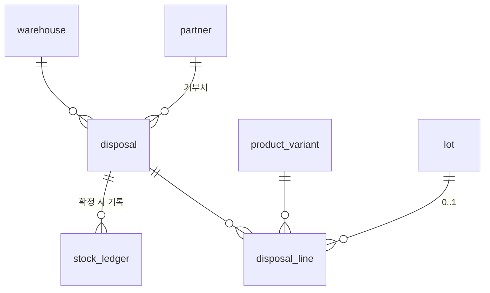

# 9. 기부 · 폐기

아홉 번째 도메인입니다. **유통기한이 다 되어가는 상품을 밖으로 내보내는 일**을
맡습니다.

```
기부   기한이 임박한 걸 단체에 준다.   세무상 기부금
폐기   기한이 지난 걸 버린다.          세무상 폐기손실
```

둘 다 **재고가 나가는데 매출이 없고, 증빙이 필요합니다.** 그래서 한 전표에 구분값만
두고 함께 다룹니다.

용어는 [glossary.md](glossary.md)에 있습니다.

---

## 1. 왜 판매채널이 아닌가

처음에 판매채널(5번)에 「기부」 판매처를 하나 넣는 안을 검토했고, **채택하지
않았습니다.**

6번 주문은 **채널 엑셀 import를 전제로** 설계돼 있습니다 —
`UNIQUE (channel_id, channel_order_no)` · `raw_data` · `import_batch` · 재import 컬럼
소유권. 기부는 이 중 아무것도 쓰지 않습니다.

억지로 넣으면 **"주문인데 주문이 아닌 것"** 이 생기고, 모든 주문 집계와 화면에
`단, 기부 채널 제외` 조건이 붙습니다. 매출 0원 주문이 섞이는 것도 문제입니다.

8번 재고의 조정 사유로 처리하는 안도 검토했고 역시 채택하지 않았습니다. 재고는
맞지만 **누구에게 줬는지가 남지 않습니다.** 조정은 "숫자 바로잡기"지 업무가 아닙니다.

---

## 2. 결정

| # | 정한 것 | 값 |
|---|---|---|
| 1 | 범위 | **기부와 폐기를 한 전표에.** 구분값으로 나눔 |
| 2 | 장부가 | **로트가 있으면 그 로트의 매입가**, 없으면 최종 매입가 |

### 2.1 이미 있는 것을 씁니다

새로 만드는 건 테이블 둘뿐입니다. 나머지는 앞 도메인에 값 하나씩만 추가합니다.

| 필요한 것 | 어디에 |
|---|---|
| 기부처 (단체명 · 사업자번호 · 담당자) | **3번 거래처.** `partner_type`에 `DONATION` 추가 |
| 재고 차감 | **4번 재고원장.** `source_type`에 `DISPOSAL` 추가 |
| 기한 임박 상품 찾기 | **8번 「기한 임박」 탭.** 이미 있습니다 |
| 송장 · 배송 | **필요 없음.** 직접 전달하거나 단체가 수거 |

### 2.2 원장 구분값을 하나만 추가한 이유

8번에서 실사와 조정을 나눌 때 기준을 세웠습니다.

> 근거 문서가 다르기 때문입니다. 실사 차이는 세어본 결과이고 조정은 사람이 사유를
> 적은 것입니다.

기부와 폐기는 **같은 전표**입니다. 그래서 `source_type`은 `DISPOSAL` 하나이고,
기부냐 폐기냐는 전표의 `disposal_type`이 들고 있습니다.

```
RECEIVING    입고    4번
SHIPPING     출고    7번
STOCKTAKING  실사    8번
ADJUSTMENT   조정    8번
DISPOSAL     기부·폐기  9번
```

---

## 3. 개념 모델

```
거래처(기부처) ──< 기부·폐기 ──< 라인 >── 옵션조합(SKU) · 로트
                      │
                      └─(확정)→ 재고원장 DISPOSAL 행 → 현재고
```



> 업무용어는 **「기부·폐기」** 지만 둘을 함께 담는 테이블 이름이 필요해
> `disposal`(처분)로 등록했습니다. 화면에는 「처분」이라는 말이 나오지 않습니다 —
> 사람은 기부와 폐기라고만 부릅니다.

### 3.1 기부·폐기 `disposal`

```
id                BIGINT         PK
disposal_no       VARCHAR        업무번호. 고유. DP-YYYY-0001
disposal_type     ENUM           DONATION | DISCARD
partner_id        BIGINT         FK → partner. DONATION 이면 필수, DISCARD 면 NULL
warehouse_id      BIGINT         FK → warehouse
disposal_date     DATE           기부일 · 폐기일
reason_code       ENUM           NEAR_EXPIRY | EXPIRED | DAMAGE | OTHER
status            ENUM           DRAFT | CONFIRMED | CANCELED
receipt_issued    BOOLEAN        기부금영수증 받았는지. DISCARD 면 항상 false
receipt_no        VARCHAR        NULL 허용
total_book_value  DECIMAL(18,2)  라인 합계 (캐시)
confirmed_at      TIMESTAMPTZ    NULL 허용
confirmed_by      BIGINT         NULL 허용. account.id
memo              TEXT           reason_code 가 OTHER 면 필수
+ 감사 컬럼 5종
```

표시 매핑 — `disposal_type`은 기부 · 폐기, `reason_code`는 기한임박 · 기한만료 ·
파손 · 기타, `status`는 작성중 · 확정 · 취소.

**`OTHER`면 메모 필수**는 8번 조정과 같은 규칙입니다.

`receipt_issued`와 `receipt_no`가 따로 있는 이유는 **영수증이 나중에 오기 때문**입니다.
기부하고 몇 주 뒤에 단체가 보내주는 일이 흔합니다. 목록에서 「영수증 미수령」으로
걸러 챙깁니다.

### 3.2 기부·폐기 라인 `disposal_line`

```
id               BIGINT         PK
disposal_id      BIGINT         FK → disposal
line_no          INT
variant_id       BIGINT         FK → product_variant
lot_id           BIGINT         FK → lot. NULL 허용
quantity         DECIMAL(18,3)  수량
unit_book_value  DECIMAL(18,2)  단위 장부가. 자동으로 채우고 수정 가능
line_book_value  DECIMAL(18,2)  quantity × unit_book_value
memo             VARCHAR        NULL 허용
+ 감사 컬럼 5종
```

**세트는 대상이 아닙니다.** 자기 재고를 갖지 않으므로
([2-product.md](2-product.md) 2.7) 실사와 같은 규칙입니다. 세트를 기부한다면
구성품 각각을 줄로 적습니다.

---

## 4. 장부가

### 4.1 자동 산정 규칙

```
lot_id 가 있으면   → 그 로트의 가장 최근 확정 입고 라인의 unit_price
없으면            → 그 조합의 가장 최근 확정 입고 라인의 unit_price
입고 이력이 없으면 → 0 으로 두고 경고. 담당자가 직접 입력
```

기한 관리하는 상품은 로트가 있으니 **어느 입고분인지 이미 알고 있습니다.** 3월에
1,000원에 받은 로트를 기부하면 1,000원이지, 8월 단가 1,200원이 아닙니다.

### 4.2 계산값을 저장하는 이유

`unit_book_value`는 자동으로 채우지만 **컬럼에 저장합니다.** 매번 다시 계산하지
않습니다.

나중에 매입가가 바뀌어도 **그때 기부한 금액은 바뀌면 안 되기 때문**입니다. 세무
자료로 나간 숫자가 조회할 때마다 달라지면 그건 자료가 아닙니다.

같은 패턴이 앞에도 있었습니다 — 4번의 `received_quantity`, 6번의 `option_label`,
8번의 `system_quantity`. **그 시점의 값을 고정하는 것**입니다.

담당자가 고칠 수 있게 열어둡니다. 세무 담당자가 다른 기준을 주는 경우가 있습니다.

---

## 5. 확정과 취소

### 5.1 확정할 때

```
1. status = CONFIRMED, confirmed_at · confirmed_by 기록
2. 라인마다 stock_ledger 에 − 행 기록
     source_type = DISPOSAL
     moved_at    = disposal_date 기준
3. stock 갱신
4. total_book_value 계산해 저장
```

**재고가 모자라면 경고하고 진행합니다** — 7번 출고와 같습니다
([7-shipping.md](7-shipping.md) 3.3). 물건은 이미 나갔거나 버려졌고, 숫자는
8번 실사로 맞춥니다.

### 5.2 못 하게 막는 것

```
DONATION 인데 partner_id 가 없음
DONATION 인데 그 거래처의 partner_type 에 DONATION 이 없음
DISCARD 인데 partner_id 가 있음
quantity 가 0 이거나 음수
```

### 5.3 취소할 때

4번 · 7번 · 8번과 같습니다 — 원장에 반대 부호 행을 쓰고 원본은 남깁니다.

**영수증 번호는 지우지 않습니다.** 실제로 발행됐을 수 있고, 지우면 그 사실을
추적할 방법이 없어집니다. 출고 취소 때 송장번호를 남기는 것과 같은 이유입니다.

---

## 6. 8번 재고에서 이어지는 흐름

이 도메인의 입구는 8번 「재고 알림」의 **기한 임박** 탭입니다.

```
기한 임박 목록에서 선택
   ↓
「기부 전표 만들기」 또는 「폐기 전표 만들기」
   ↓
선택한 (조합, 로트, 수량)이 라인으로 채워지고 장부가가 자동 계산됨
   ↓
기부처를 고르고 확정
```

**기한이 남은 건 기부, 지난 건 폐기**가 기본값이고 담당자가 바꿀 수 있습니다.
한 화면에서 "이건 기부할까 버릴까"가 결정됩니다.

---

## 7. 다른 도메인에 생기는 변화

| 문서 | 변화 |
|---|---|
| [3-partner.md](3-partner.md) | `partner_type`에 `DONATION` 추가 |
| [4-receiving.md](4-receiving.md) | `stock_ledger.source_type`에 `DISPOSAL` 추가 |
| [8-stock.md](8-stock.md) | 「기한 임박」에서 전표 생성으로 이어짐 |

---

## 8. 채번 규칙

```
disposal_no   DP-YYYY-0001   연도별 리셋
```

---

## 9. 화면

| 화면 | 레이아웃 | 구성 |
|---|---|---|
| 기부·폐기 목록 | **4** 상태별 탭 목록 | 작성중 · 확정 · 취소 + 기부/폐기 · 「영수증 미수령」 필터 |
| 기부·폐기 전표 | **17** 전표 입력 | 헤더(구분 · 기부처 · 사유 · 영수증) + 라인(수량 · 장부가) |
| **기부 명세** | **21** 집계 리포트 | 기간 · 기부처별 장부가 합계 |

### 9.1 기부 명세가 이 도메인의 산출물입니다

연말에 세무 자료로 나가는 화면입니다. 30종 레이아웃 중 **21번 집계 리포트를 처음
쓰는 곳**이기도 합니다.

```
기간         2026-01-01 ~ 2026-12-31
기부처별     단체명 · 사업자번호 · 건수 · 장부가 합계 · 영수증 수령 건수
품목별       상품 · 조합 · 수량 · 장부가 합계
```

**「영수증 미수령」 건수를 항상 같이 보여줍니다.** 명세는 맞는데 영수증이 없으면
손금산입이 안 됩니다. 숫자만 보여주고 그걸 안 알려주면 연말에 발견합니다.

---

## 10. 도메인 설계 완료

9개 도메인이 모두 끝났습니다.

```
1 사용자·권한 → 2 상품 → 3 거래처 → 4 입고
              → 5 판매채널 → 6 주문 → 7 출고·송장 → 8 재고 → 9 기부·폐기
```

기술 스택과 스택 종속 컨벤션도 확정됐습니다. 남은 것은 [TODO.md](../../TODO.md)
5단계 착수입니다.
