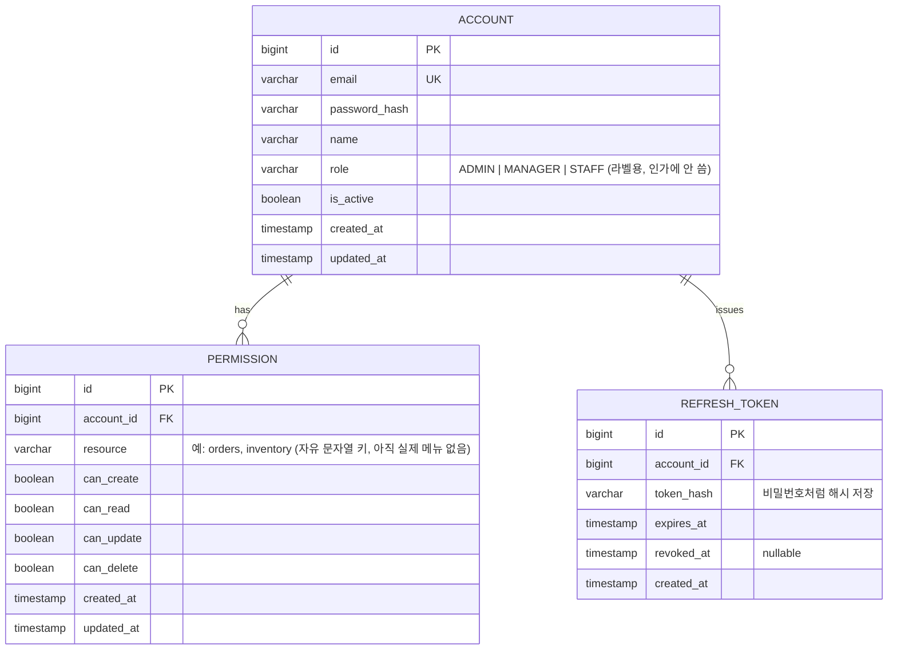

# 인증/로그인 — 스키마

## ERD

## 테이블 정의

### `account`

| 컬럼 | 타입 | 제약 | 설명 |
|---|---|---|---|
| `id` | bigint | PK | - |
| `email` | varchar | UNIQUE, NOT NULL | 로그인 ID |
| `password_hash` | varchar | NOT NULL | BCrypt 해시 |
| `name` | varchar | NOT NULL | 표시 이름 |
| `role` | varchar | NOT NULL | `ADMIN` / `MANAGER` / `STAFF` — 분류(classification) 필드. 인가 판단에는 쓰지 않음 (`docs/rule/naming-convention.md`의 상태/분류 구분 참조) |
| `is_active` | boolean | NOT NULL, default true | 상태(state) 필드 — 비활성화 시 로그인 차단 |
| `created_at` | timestamp | NOT NULL | - |
| `updated_at` | timestamp | NOT NULL | - |

> **명명 참고:** 엔티티/테이블명을 `User`/`user`가 아니라 `Account`/`account`로 정했다. PostgreSQL에서 `USER`는 예약어(현재 세션 사용자를 가리키는 `SELECT USER` 등 특수 토큰과 겹침)라 테이블명으로 쓰면 항상 큰따옴표로 감싸야 하는 등 불필요한 마찰이 생긴다.

### `permission`

| 컬럼 | 타입 | 제약 | 설명 |
|---|---|---|---|
| `id` | bigint | PK | - |
| `account_id` | bigint | FK → `account.id`, NOT NULL | - |
| `resource` | varchar | NOT NULL | 리소스(메뉴) 키. FK 아님 — 실제 업무 메뉴가 아직 없어 자유 문자열로 둠 |
| `can_create` | boolean | NOT NULL, default false | - |
| `can_read` | boolean | NOT NULL, default false | - |
| `can_update` | boolean | NOT NULL, default false | - |
| `can_delete` | boolean | NOT NULL, default false | - |
| `created_at` | timestamp | NOT NULL | - |
| `updated_at` | timestamp | NOT NULL | - |

- UNIQUE(`account_id`, `resource`) — 계정당 리소스당 권한 행은 하나.

### `refresh_token`

| 컬럼 | 타입 | 제약 | 설명 |
|---|---|---|---|
| `id` | bigint | PK | - |
| `account_id` | bigint | FK → `account.id`, NOT NULL | - |
| `token_hash` | varchar | NOT NULL | 원문 대신 해시 저장 |
| `expires_at` | timestamp | NOT NULL | 발급 시각 + 14일 |
| `revoked_at` | timestamp | nullable | 로그아웃/회전 시 기록 |
| `created_at` | timestamp | NOT NULL | - |

## 관계 요약

- `account` 1 : N `permission` — 계정당 리소스(메뉴)별로 최대 1행, CRUD 4개 불리언
- `account` 1 : N `refresh_token` — 로그인마다 새로 발급, 로그아웃/재발급 시 이전 것 revoke
- `role`은 라벨일 뿐, 실제 인가는 100% `permission` 테이블 기준. admin도 예외 없이 `permission` 행이 있어야 해당 리소스에 접근 가능하다 — 지금은 `@RequiresPermission`이 걸린 실제 업무 API가 없어 당장 잠길 위험은 없지만, 이후 리소스가 하나씩 추가될 때마다(권한 관리 화면이 생기기 전까지는) 시드/수동 DB 작업으로 admin의 `permission` 행도 함께 넣어줘야 한다.
